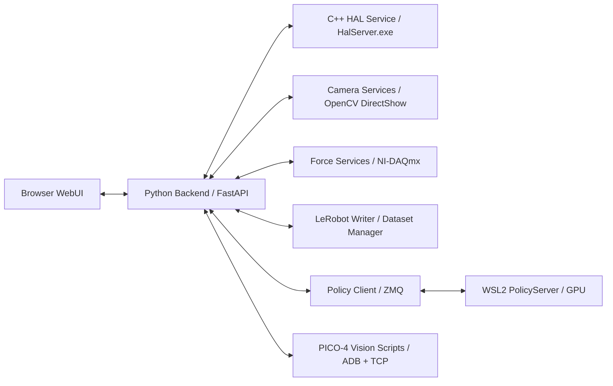

# AppStation M0 后端开发指南（AI Agent 专用）

> 版本日期：2026-04-28（v1.1 修订：修正 API 路径前缀、力觉单位、旋转换算；补充 LeRobot Windows 兼容性、RTX 5090 推理策略、NI-DAQmx 路线说明）  
> 适用阶段：前端初版完成后，开始开发 Windows 后端、C++ HAL、硬件接入和数据闭环。  
> 目标读者：接手本项目后端开发的 AI 编程工具或工程师。

本文不是控件到接口的简单映射表。后端开发者必须先理解 AppStation 的运行逻辑：这是一个部署在推理设备上的双臂微装配工作站，核心任务是安全地采集高质量 LeRobot 数据、复核数据质量，并在后续阶段加载策略模型做自动执行。前端当前以 Mock 模式完成交互闭环，真实后端需要在不破坏前端体验的前提下逐步替换 Mock 数据源。

## 1. 当前前端事实

### 1.1 技术栈与边界

- 前端路径：`frontend/`
- 技术栈：React 18、TypeScript strict、Vite、Ant Design v5、Zustand v5、ECharts、lucide-react。
- 架构层次必须保持：`types.ts -> data.ts -> api/index.ts -> stores/telemetry.ts -> components/ -> views/`
- 状态唯一入口：`useTelemetryStore`。前端异步命令统一从 store action 发起，组件不直接调用后端。
- Mock 默认开启：`VITE_MOCK_MODE !== 'false'`。真实后端只在 `VITE_MOCK_MODE=false` 时被调用。
- 后端不得要求前端导入 Node.js API、启动本地进程或直接写文件。

### 1.2 当前页面模块

| 路由 | 页面 | 后端含义 |
| --- | --- | --- |
| `/` | 主页 | 汇总 HAL、相机、力觉、PICO、Omega.7、夹爪、运动控制卡状态 |
| `/record` | 录制 | 数据采集主工作流，预检后开始 session，保存 episode 后弹出质量报告 |
| `/dataset` | 数据集 | 数据集与 episode 管理，同步视频、双臂轨迹、双力传感器曲线质检 |
| `/model` | 模型 | 策略 checkpoint 管理、PolicyServer 启停入口 |
| `/fine-tune` | 微调 | 预留空白页，暂不实现复杂训练可视化 |
| `/auto` | 自动 | 策略推理执行、动作队列、急停、调试注入入口 |
| `/settings` | 设置 | 所有硬件参数、主手、PICO-4 推流、运动控制卡快照、手动控制 |

已删除或不再需要的前端方向：

- `训练` 页面已取消；训练参数复杂，现阶段不做完整可视化。
- `诊断` 页面已取消；主页承担人工观察硬件健康状态。
- PICO-4 设置区域只负责视频推流到头显，不要把 OpenXR 或 Omega.7 混到该区域。

### 1.3 前端 REST 边界（当前已调用）

`frontend/src/api/index.ts` 当前只定义了最小 REST 封装。后端第一阶段必须兼容这些路径：

| 方法 | 路径 | 请求体 | 用途 |
| --- | --- | --- | --- |
| GET | `/api/settings` | - | 读取完整硬件配置 |
| POST | `/api/record/session/create` | `{ dataset_name, task }` | 预检通过后创建录制 session |
| POST | `/api/record/episode/save` | - | 保存当前 episode 并触发质量分析 |
| POST | `/api/record/episode/discard` | - | 丢弃当前 episode 或退回重录 |
| POST | `/api/record/session/finish` | - | 结束 session，必要时 finalize 数据集 |
| POST | `/api/record/reset/skip` | - | 跳过复位等待，进入下一条 |
| POST | `/api/sensors/tare` | - | 力传感器清零 |
| POST | `/api/teleop/clutch_toggle` | - | 遥操作离合切换 |
| POST | `/api/teleop/speed` | `{ mode }` | 粗/中/精速度档切换 |
| POST | `/api/motion/emergency_stop` | - | 硬件急停 |
| POST | `/api/motion/home_all` | - | 双臂回工作原点 |

所有 POST 推荐统一返回：

```json
{
  "ok": true,
  "data": {},
  "ts": 1777366915827
}
```

错误统一返回：

```json
{
  "ok": false,
  "code": "SOFT_LIMIT",
  "message": "Axis left.yaw exceeds soft limit"
}
```

### 1.4 前端实时数据模型

前端 `TelemetryFrame` 是实时 WebSocket 数据的目标形状。后端应以此为第一版 `/ws` 合约：

```ts
interface TelemetryFrame {
  timestamp: number
  elapsedSec: number
  jointPositions: number[]       // length=12, 左6轴 + 右6轴；平移 μm，旋转 °
  gripperPositions: number[]     // length=2
  forceLeft: number[]            // Fx,Fy,Fz,Mx,My,Mz
  forceRight: number[]
  dangerIndex: number
  recording: boolean
  episodeCount: number
  frameCount: number
  halOk: boolean
  wsOk: boolean
  cameras: CameraTelemetry[]
  queueDepth: { left: number; right: number }
  resource: { uiFps: number; wsHz: number; cpuPct: number; memMb: number }
  processStatus: ProcessStatus[]
}
```

推荐 WebSocket 地址：

- Python Backend 对前端：`ws://localhost:8080/ws`
- C++ HAL 对 Python Backend：`ws://localhost:8091/ws/telemetry` 或等价本机 WS

## 1.5 LeRobot Windows 兼容性约束（开发前必读）

> ⚠️ **这是整个后端开发中最容易踩的环境坑，AI Agent 必须在写任何 LeRobot 相关代码前阅读本节。**

### 安装方式：必须用 conda，不能用纯 pip

```bash
# 正确安装顺序（Windows，conda 环境 appstation_backend）
conda create -n appstation_backend python=3.12 -y
conda activate appstation_backend

# 必须先装 ffmpeg + av，且顺序不能反（codec 配套问题）
conda install -c conda-forge ffmpeg=7.1.1 -y
conda install -c conda-forge av -y

# LeRobot 核心（跳过 evdev/gym 等 Linux 专属依赖）
pip install lerobot --no-deps
pip install torch torchvision --index-url https://download.pytorch.org/whl/cpu
pip install pyarrow datasets huggingface-hub safetensors einops draccus

# 后端其他依赖
pip install fastapi uvicorn[standard] httpx pyzmq msgpack pyserial psutil nidaqmx
```

### 可以在 Windows 直接 import 的 LeRobot 模块（✅）

```python
from lerobot.common.datasets.lerobot_dataset import LeRobotDataset   # ✅ 数据集读写
from lerobot.common.policies.act.modeling_act import ACTPolicy        # ✅ 推理
from lerobot.common.policies.diffusion.modeling_diffusion import DiffusionPolicy  # ✅ 推理
from lerobot.common.utils.utils import precise_sleep                  # ✅ 工具函数
```

### 禁止整体 import 的 LeRobot 脚本（❌）

```python
# ❌ 禁止：lerobot_record.py 依赖 evdev（Linux 内核接口，Windows 无法安装）
from lerobot.scripts.lerobot_record import *

# ✅ 正确做法：只复制需要的函数到 backend/utils/lerobot_utils.py
# 例如 precise_sleep、帧率控制循环逻辑——直接复制那几十行，不通过 import 引用
```

### consolidate() 写视频前必须验证编码器

```bash
# 在 conda 环境中执行，必须看到 libsvtav1
ffmpeg -encoders | findstr svt

# 如果没有 libsvtav1，consolidate() 会在录制结束时静默失败
# 解决：重新 conda install -c conda-forge ffmpeg=7.1.1 av（按顺序）
```

### LeRobot dataset create() 正确调用方式

```python
# ✅ 正确：repo_id 必须是 "user/name" 格式，root 指定本地路径
dataset = LeRobotDataset.create(
    repo_id="appstation/micro_assembly_v1",
    root=Path(config.dataset_root),   # 来自 config.json，Windows 路径
    fps=30,
    features=FEATURES,
    robot_type="dual_arm_micro_assembly",
)

# ❌ 错误：repo_id 不能是本地路径
dataset = LeRobotDataset.create(repo_id="C:/Users/.../datasets/micro_assembly_v1", ...)
```

## 2. 推荐后端总体架构

### 2.1 进程划分



职责边界：

- C++ HAL Service：只封装 Windows-only SDK 和强实时硬件访问，尤其是 LTDMC 与 Omega.7。HAL 不做业务状态机、不写数据集。
- Python Backend：负责 FastAPI、前端 WebSocket、录制状态机、安全策略、相机、力觉、数据集、PICO 脚本、PolicyServer 进程管理。
- WSL2 PolicyServer：只负责需要 CUDA 的策略推理或训练相关工作，通过 ZMQ/msgpack 与 Windows 后端通信。

严禁事项：

- Python 直接 `ctypes` 调 `LTDMC.dll` 或 `dhd.dll`。
- 前端直接调用硬件 SDK、启动本地脚本或绕过 Backend。
- 多线程同时调用 LTDMC SDK。
- 后端接口直接按 UI 控件临时拼字段，不建立统一数据模型。

### 2.2 必要服务线程

| 服务 | 建议频率 | 所属进程 | 说明 |
| --- | ---: | --- | --- |
| MotionControl Thread | 1000 Hz | C++ HAL | 串行化 LTDMC 调用、运动指令、急停、软限位 |
| HAL Telemetry Broadcast | 100 Hz | C++ HAL | 推送位置、主手、运动状态、硬件健康 |
| Omega.7 Poll | 100 Hz UI / SDK 可到 4 kHz | C++ HAL | 读取两台主手，计算离合/增量映射 |
| Force Sampling | 200 Hz 起步 | Python | NI-DAQmx 读取、标定、滤波、tare、安全检查 |
| Camera Capture | 30 Hz | Python | 三路 DirectShow/OpenCV，记录原始帧和预览帧 |
| Recorder Loop | 30 Hz | Python | 对齐 state/action/image/force 并写 LeRobot |
| Frontend Telemetry | 50 Hz | Python | 向前端广播降采样后的状态 |
| Policy Action Queue | 30 Hz | Python/WSL2 | 推理动作接收、限幅、下发 |

## 3. 数据和单位约定

### 3.1 双臂状态向量

`observation.state` 和前端 `jointPositions` 必须采用同一语义顺序：

```text
[left_X, left_Y, left_Z, left_Roll, left_Pitch, left_Yaw,
 right_X, right_Y, right_Z, right_Roll, right_Pitch, right_Yaw]
```

单位要分清：

- 前端实时 `TelemetryFrame.jointPositions`：平移轴为 `μm`，旋转轴为 `°`。
- LeRobot `observation.state`：建议平移轴为 `μm`，旋转轴为 `0.001°`，但必须在 dataset schema 中固定。
- 不要把 `0.001°` 的旋转值直接推给前端 UI，否则显示角度会放大 1000 倍。

建议后端内部采用两个字段避免歧义：

```json
{
  "positions_physical": [12.3, 4.5, 0.0, 0.12, 0.03, -0.02],
  "position_units": ["mm", "mm", "mm", "deg", "deg", "deg"],
  "ui_joint_positions": [12300, 4500, 0, 0.12, 0.03, -0.02],
  "observation_state": [12300, 4500, 0, 120, 30, -20]
}
```

写 LeRobot 时使用 `observation_state`，前端 WebSocket 使用 `ui_joint_positions`。

> ⚠️ **旋转单位换算是高频出错点**，必须在后端统一处理，不要分散在各处：

```python
# backend/core/units.py — 唯一的单位换算入口

ROTATION_AXES = {3, 4, 5, 9, 10, 11}  # observation.state 中旋转轴的索引

def pulse_to_lerobot(pulse: float, axis_idx: int, pulse_per_unit: float) -> float:
    """脉冲 → LeRobot observation.state 单位（μm 或 0.001°）"""
    return pulse / pulse_per_unit * 1000.0

def pulse_to_ui(pulse: float, axis_idx: int, pulse_per_unit: float) -> float:
    """脉冲 → 前端 TelemetryFrame 单位（μm 或 °）"""
    lerobot_val = pulse_to_lerobot(pulse, axis_idx, pulse_per_unit)
    if axis_idx in ROTATION_AXES:
        return lerobot_val / 1000.0   # 0.001° → ° （前端显示用）
    return lerobot_val                 # μm 不变

# 错误示范（会让前端角度放大 1000 倍）：
# ❌ ui_joints[i] = pulse / pulse_per_unit * 1000.0  # 旋转轴结果是 0.001°，非 °
```

### 3.2 LTDMC 轴映射

左臂 Card 1：

| 语义轴 | 物理轴 | state index |
| --- | ---: | ---: |
| X | 0 | 0 |
| Y | 1 | 1 |
| Z | 3 | 2 |
| Roll | 5 | 3 |
| Pitch | 4 | 4 |
| Yaw | 2 | 5 |

右臂 Card 0：

| 语义轴 | 物理轴 | state index |
| --- | ---: | ---: |
| X | 2 | 6 |
| Y | 0 | 7 |
| Z | 5 | 8 |
| Roll | 8 | 9 |
| Pitch | 1 | 10 |
| Yaw | 7 | 11 |

关键坑：

- 右臂 Roll 是物理轴 8，不在 0-5 范围内。
- Yaw 全行程仅 ±8°，软件限位必须小于等于 ±7.5°。
- 本平台是步进系统，无独立外部编码器；根据当前硬件参考手册和上位机源码，应使用 `dmc_get_position()` 读取内部脉冲计数，不要使用旧文档里提到的 `dmc_get_encoder()` 结论。

### 3.3 脉冲当量

| 轴 | 左臂 pulse/mm 或 pulse/deg | 右臂 pulse/mm 或 pulse/deg |
| --- | ---: | ---: |
| X | 9000 | 4878.0487804878 |
| Y | 10000 | 10000 |
| Z | 10000 | 1923.07692307692 |
| Roll | 1666.666667 | 1666.666667 |
| Pitch | 2500 | 2500 |
| Yaw | 3333.333333 | 3333.333333 |

换算：

```python
physical_um_or_mdeg = pulse / pulse_per_unit * 1000.0
pulse = physical_um_or_mdeg * pulse_per_unit / 1000.0
```

### 3.4 工作原点

当前文档记录的工作原点脉冲：

| 机构 | X | Y | Z | Roll | Pitch | Yaw |
| --- | ---: | ---: | ---: | ---: | ---: | ---: |
| 左臂 | -11493 | -85019 | -408 | 14988 | -34685 | 40228 |
| 右臂 | -233 | -297451 | 199927 | 4427 | 18890 | -180 |

更新时间：`2026-04-20T12:34:39`

后端需要把工作原点作为配置项持久化，并提供“回工作原点”和“保存当前为工作原点”的安全确认流程。不要把这些值硬编码在 HAL 里。

## 4. 硬件接入指南

### 4.1 LTDMC / DMC3000 运动控制卡

硬件事实：

- 两张 LTDMC 控制卡：Card 0 右臂，Card 1 左臂。
- 初始化使用 `dmc_board_init()`，无参数，自动发现两张卡。
- 所有 LTDMC SDK 调用必须在 C++ HAL 的 MotionControl Thread 中串行执行。
- 前端设置页中的运动控制卡参数包括卡号、位置源、线程频率、速度 profile、软限位、快照保存/应用。

HAL 推荐接口：

> ⚠️ 以下路径为 **C++ HAL Service**（port 8091）内部接口，由 Python Backend 调用，不直接暴露给前端。

| 方法 | 路径（HAL 内部，port 8091） | 说明 |
| --- | --- | --- |
| GET | `/health` | 返回 ltdmc_ok、omega7_ok、版本、uptime |
| GET | `/motion/state` | 读取 12 轴位置、速度、运动中标志 |
| POST | `/motion/move_all` | 12 轴目标位置下发，HAL 内部检查软限位 |
| POST | `/motion/jog` | 单轴点动 |
| POST | `/motion/home_all` | 双臂回工作原点 |
| POST | `/motion/home_axis` | 单轴回零 |
| POST | `/motion/emergency_stop` | 硬急停，必须尽量短路径执行（<1ms DLL 直调） |
| POST | `/motion/config` | 应用 profile、软限位、卡号等配置 |

前端访问运动功能时，统一调用 **Python Backend**（port 8080）的 `/api/motion/*` 接口，由 Backend 转发到 HAL。

安全要求：

- `emergency_stop` 不能依赖 Python 队列排队，HAL 侧必须有直接急停路径。
- 每次运动前检查：连接状态、急停状态、软限位、Yaw 特殊限位、速度/加速度范围。
- 对外返回语义轴，内部再映射物理轴；不要让 Python 业务层散落处理 `axisOrder`。

### 4.2 ATI Nano-17 六维力传感器

**两种接入路线的关系说明：**

| 路线 | 采集方式 | 当前状态 | 采样率 |
| --- | --- | --- | --- |
| **NI-DAQmx（当前使用）** | NI-DAQ 硬件盒（Dev3/Dev5）采集模拟电压 + `.cal` 标定矩阵换算 | ✅ 已在源码中实现，优先采用 | 200 Hz |
| UDP RDT（备选） | ATI Net F/T 以太网盒，UDP 直读 | 暂未使用，硬件上没有以太网盒 | 可达 7kHz |

> 说明：200Hz 对于 30Hz 录制主循环完全够用，安全检查也满足要求。两条路线通过 `ForceDriver` 抽象隔离，将来若换以太网盒，只新增 `AtiRdtForceDriver` 实现，上层业务不变。

**后端开发优先级：**

1. M1/M2 先实现与现有源码一致的 NI-DAQmx 路线。
2. 把采集实现隐藏在 `ForceDriver` 抽象后面。
3. 若现场以后确认更换 Net F/T 以太网盒，再新增 `AtiRdtForceDriver`，不要改上层业务。

当前参数：

| 项 | 左 | 右 |
| --- | --- | --- |
| 传感器 | ATI Nano17 SI-12-0.12 | ATI Nano17 SI-12-0.12 |
| 序列号 | FT32918 | FT38799 |
| DAQ | Dev5 | Dev3 |
| 通道 | ai0:5 | ai0:5 |
| 模式 | DIFF | DIFF |
| 电压范围 | -10V 到 10V | -10V 到 10V |
| 采样率 | 200 Hz | 200 Hz |
| 标定文件 | `FT32918.cal` | `FT38799.cal` |
| 低通 | 10 Hz | 10 Hz |

输出顺序：

```text
Fx, Fy, Fz, Mx, My, Mz
```

**单位规范（全项目统一，禁止混用）：**

| 层次 | 力单位 | 力矩单位 |
| --- | --- | --- |
| 后端业务层 / HAL 接口 | `N` | `Nm` |
| LeRobot 存储（observation.force_*） | `N` | `Nm` |
| 前端 TelemetryFrame.forceLeft/Right | `N` | `Nm` |
| 前端 UI 显示（可选格式化） | `mN`（×1000）或 `N` | `mNm`（×1000）或 `Nm` |
| Settings 安全阈值配置字段 | `N`（存储），UI 可显示 `mN` | `Nm`（存储），UI 可显示 `mNm` |

> ⚠️ Settings 页面旧版显示过 `mN`/`mN·m`，但 **config.json 落盘必须存 N/Nm**，前端做显示格式化，后端不做单位转换。dangerIndex 计算基于 N/Nm 阈值（Fxy_stop=4N，Fz_stop=5N，Txy_stop=0.04Nm）。

必须实现：

- 左/右/全部 tare。
- 原始电压、标定后六维量、滤波后六维量可调试输出。
- 传感器掉线、DAQ 任务异常、标定文件缺失必须进入安全状态。
- 安全检查不能只依赖前端，Backend 内部要直接触发 HAL 急停。

### 4.3 三路相机

当前前端按最终目标展示：

| 角色 | 前端型号 | 目标原始比例 |
| --- | --- | --- |
| 全局相机 | IMX258 | 3840x3104 |
| 左腕相机 | GC5024 | 2952x1944 |
| 右腕相机 | GC5024 | 2952x1944 |

硬件参数文档中的旧源码配置：

- OpenCV DirectShow。
- Left/Right：MJPG 1920x1080@30。
- Global：YUY2 1920x1080@30。
- `PreferredCameraIndices = 0,2,1`。

后端必须区分：

- 传感器物理能力分辨率。
- DirectShow 实际协商采集分辨率。
- 前端预览分辨率。
- 数据集保存视频分辨率。

建议相机状态字段：

```json
{
  "key": "wrist_left",
  "label": "左腕相机",
  "model": "GC5024",
  "device_index": 1,
  "friendly_name": "USB Camera ...",
  "raw_resolution": "2952x1944",
  "capture_resolution": "1920x1080",
  "preview_resolution": "480x316",
  "fps": 29.8,
  "timestamp_skew_ms": 3.4,
  "frame_age_ms": 31,
  "health": "ok"
}
```

录制链路：

- Python 摄像头线程保存原始或高质量帧给 LeRobot Writer。
- 前端 WebSocket 只推下采样 JPEG 或状态，不要把三路全分辨率持续推给 UI。
- 每帧必须带 monotonic timestamp，用于和 state/force/action 对齐。

### 4.4 PICO-4 视觉推流

PICO-4 区域只做视频推流到头显显示，不负责 Omega.7，不需要 OpenXR 出现在当前前端 UI。

参数：

| 参数 | 当前值 |
| --- | --- |
| PICO IP | `10.90.131.124` |
| ADB Port | `5555` |
| Video Port | `12345` |
| Command Port | `13579` |
| Gateway | `10.90.0.1` |
| IfIndex | `13` |
| Rotation | `ccw90` |

现有上位机逻辑：

- UI 启动 BAT 脚本。
- 脚本用 ADB 做连接、状态检查、启动/停止。
- PC 端 sender 从本机相机取图，编码 H.264，经 TCP 推给 PICO。
- 命令端口和视频端口必须与 PICO APK 保持一致。

后端建议接口：

| 方法 | 路径 | 说明 |
| --- | --- | --- |
| GET | `/api/pico/status` | ADB、sender、路由、端口状态 |
| POST | `/api/pico/adb/connect` | 连接无线 ADB |
| POST | `/api/pico/vision/start` | 启动 sender 和视频推流 |
| POST | `/api/pico/vision/stop` | 停止 sender |
| POST | `/api/pico/status/check` | 执行状态检查脚本 |
| POST | `/api/pico/config` | 保存 IP/端口/网关/旋转/相机源 |

日志必须把脚本 stdout/stderr 推到 Log Panel，尤其是 ADB 连接失败、端口占用、防火墙阻断。

### 4.5 Omega.7 双主手

官方规格：

- 平移工作区：直径 160 mm x 110 mm。
- 旋转工作区：Roll 240° / Pitch 140° / Yaw 180°。
- 夹持行程：25 mm。
- 平移最大力：12 N。
- 夹持力：±8 N。
- 平移分辨率：<0.01 mm。
- 旋转分辨率：0.09°。
- 刷新率最高 4 kHz。
- USB 2.0，支持 Windows/Linux/macOS。
- 自动、无漂移标定，支持重力补偿和电磁阻尼安全。

连接方式：

- 优先本机 Force Dimension SDK：`dhdGetDeviceCount()`、`dhdOpenID()`、`dhdGetPositionAndOrientationDeg()`、`dhdGetSerialNumber()`。
- 两台主手通过 `dhdOpenID(0)`、`dhdOpenID(1)` 区分，建议固定 USB 口顺序，并在设置页保存左右 openId 和序列号。
- 若本机设备不可用，可保留 TCP fallback，但不应作为默认主路径。

后端必须支持：

- 左/右主手分别连接、断开、校准、状态读取。
- 左/右 openId 配置、序列号显示、左右手属性显示。
- 重力补偿开关。
- 清零力反馈。
- 读取周期和命令周期配置。
- 平移比例、旋转比例、deadzone、稳定模式 `track/hold/free`。
- 离合按钮、夹爪按钮状态。

Omega.7 校准要点：

- 每次上电后需要校准。
- 位置校准：把设备保持在中心/原点姿态，等待状态灯停止闪烁。
- 腕部/夹持校准：移动各旋转轴和夹爪到行程端，设备自动识别。
- 自动校准过程中不要触碰或移动。

### 4.6 夹爪 EPG006

现有前端配置：

- 左：COM3，slave id 1。
- 右：COM4，slave id 2。
- 波特率默认来自配置。
- 行程显示 0-26 mm。
- 命令力限制 N。

后端建议：

- Python `pyserial` 管理 RS485。
- 夹爪状态进入 telemetry：位置、目标、使能、故障、运动中。
- 录制时把长度为 2 的 `gripperPositions` 追加进 observation 或 info schema，是否纳入 LeRobot features 必须固定。

## 5. 录制与数据集工作流

### 5.1 前端录制状态机

当前 `RecordSessionState.phase`：

```text
idle -> recording -> saving -> resetting -> recording
                       |            |
                       |            -> finish -> idle
                       -> reject -> recording
```

重要前端行为：

- 点击“开始采集会话”只打开预检弹窗。
- 只有预检确认后才调用 `/record/session/create` 并进入 `recording`。
- 点击保存后进入 `saving`，生成 `latestQualityReport`，质量报告弹窗打开。
- 接受报告后清除报告并进入 `resetting`。
- 重录会调用 discard，撤回当前 episode，回到 `recording`。

后端必须保持同样业务语义，不要在预检前创建真实 session。

### 5.2 LeRobot 数据写入

推荐数据字段：

```text
observation.state: float32[12]
observation.images.global: video/image
observation.images.wrist_left: video/image
observation.images.wrist_right: video/image
observation.force_wrist_left: float32[6]
observation.force_wrist_right: float32[6]
observation.gripper: float32[2] optional
action: float32[12] 或包含 gripper 的固定维度
timestamp_ns: int64
task: string
```

写入要求：

- 30 Hz 固定采样，落盘前对齐三路相机、12 轴状态、双力觉和 action。
- 每个 episode 保存后立即计算质量报告。
- `dataset.consolidate()` 或视频编码必须在 session finalize 或明确阶段执行，不要阻塞 UI 主链路太久。
- Windows 侧写数据集，WSL2 侧读取训练/推理；不要把 30Hz 大图像帧跨 Windows/WSL2 实时传输。

### 5.3 Episode 质量报告

保存单条后后端应返回或推送：

```json
{
  "index": 42,
  "frameCount": 702,
  "durationS": 23.4,
  "status": "ok",
  "maxForceLeft": 3.2,
  "maxForceRight": 5.8,
  "lateFrames": 1,
  "cameraDrops": { "global": 0, "wristLeft": 1, "wristRight": 0 },
  "warnings": ["左腕相机掉 1 帧"],
  "passed": false
}
```

质量指标至少包括：

- 三路相机帧数和掉帧。
- 最大时间戳偏差、帧间隔抖动。
- 双臂状态帧数与 action 帧数。
- 双力传感器最大力/力矩和阈值接近情况。
- 是否触发急停、安全降级、人工干预。

### 5.4 数据集页面需要的后端接口

| 方法 | 路径 | 说明 |
| --- | --- | --- |
| GET | `/api/datasets` | 列出数据集、状态、episode 数、平均质量 |
| POST | `/api/datasets` | 新建数据集 |
| PATCH | `/api/datasets/{dataset_id}` | 重命名、标记、备注 |
| DELETE | `/api/datasets/{dataset_id}` | 删除数据集，必须二次确认 |
| GET | `/api/datasets/{dataset_id}/episodes` | 列出 episode |
| GET | `/api/datasets/{dataset_id}/episodes/{episode_id}` | 读取 metadata、质量报告 |
| PATCH | `/api/datasets/{dataset_id}/episodes/{episode_id}` | 重命名、标记有效/无效 |
| DELETE | `/api/datasets/{dataset_id}/episodes/{episode_id}` | 删除单条 |
| GET | `/api/datasets/{dataset_id}/episodes/{episode_id}/video/{camera}` | 返回 mp4 或可 range seek 的视频 |
| GET | `/api/datasets/{dataset_id}/episodes/{episode_id}/timeseries` | 返回轨迹和力觉曲线，支持按帧抽样 |

视频播放要求：

- 支持浏览器原生拖动、快进/回退、x2/x4 播放。
- 后端视频响应必须支持 HTTP Range，否则大文件拖动体验会很差。
- 轨迹和力觉数据要能按当前视频帧索引查询或一次返回降采样数组。

## 6. 自动执行、模型与微调

### 6.0 RTX 5090 推理与微调环境决策

> **背景**：本 APP 为推理端部署，显卡为 RTX 5090（Blackwell，sm_120 架构）。后续可能做小规模微调。

**推理路线：Windows 本地优先，WSL2 备选**

```
启动策略服务时：
  Step 1：尝试 Windows 本地推理
    条件：PyTorch Windows + CUDA 对 sm_120 可用
    优点：无跨系统通信，推理延迟最低（无 ZMQ 开销）
    所需版本：torch>=2.7 或 nightly，cu128（cu124 对 Blackwell 支持不完整）

  Step 2：若 Windows 本地失败，退回 WSL2 PolicyServer（ZMQ）
    适用情况：Windows CUDA 驱动问题、算子不支持
    WSL2 CUDA 要求：WSL2 kernel >= 5.15，Windows 驱动 >= 572
```

**微调路线：必须在 WSL2 Ubuntu 中执行**

```
原因：flash-attention、bitsandbytes 等微调关键库仅有 Linux 版本
流程：
  Windows 采集数据 → 写入 C:\...\datasets       ↓（不需要复制，共享路径）
  WSL2 /mnt/c/...\datasets\ 读取数据 → 跑微调
       ↓
  WSL2 保存新权重到 /mnt/c/...\checkpoints       ↓
  Windows Python 加载新权重，更新推理模型
```

**首次上机必须执行的验证命令：**

```bash
# Windows CMD（验证本地推理可行性）
python -c "import torch; print(torch.cuda.get_device_name(0)); print(torch.cuda.get_device_capability())"
# 期望输出：NVIDIA GeForce RTX 5090, (12, 0)

# WSL2 内（验证微调环境）
python -c "import torch; print(torch.cuda.is_available(), torch.cuda.get_device_name(0))"
python -c "import flash_attn; print('flash-attn ok')"

# WSL2 CUDA 驱动验证
nvidia-smi   # 应看到 RTX 5090
```

**PolicyServer 实现建议：**

```python
# backend/services/policy_service.py
class PolicyService:
    def __init__(self):
        self._mode = None  # 'local' or 'wsl2'
        self._policy = None

    async def start(self, checkpoint_path: str, prefer_local: bool = True):
        if prefer_local:
            try:
                self._policy = self._load_local(checkpoint_path)
                self._mode = 'local'
                logger.info("[POLICY] 使用 Windows 本地推理（RTX 5090）")
                return
            except Exception as e:
                logger.warning(f"[POLICY] 本地推理失败，退回 WSL2: {e}")
        # 退回 WSL2 ZMQ PolicyServer
        self._mode = 'wsl2'
        await self._start_wsl2_server(checkpoint_path)

    def _load_local(self, checkpoint_path: str):
        from lerobot.common.policies.act.modeling_act import ACTPolicy
        import torch
        device = 'cuda' if torch.cuda.is_available() else 'cpu'
        policy = ACTPolicy.from_pretrained(checkpoint_path)
        return policy.to(device).eval()
```

### 6.1 Model 页面

“启动服务”应启动或连接策略服务，而不是直接让机械臂运动。建议接口：

| 方法 | 路径 | 说明 |
| --- | --- | --- |
| GET | `/api/models` | 列出 checkpoint、状态、延迟预算 |
| POST | `/api/models/import` | 导入 checkpoint |
| POST | `/api/policy/server/start` | 启动 WSL2 PolicyServer 或连接现有服务 |
| POST | `/api/policy/server/stop` | 停止服务 |
| GET | `/api/policy/server/status` | pid、GPU、VRAM、延迟、健康 |

### 6.2 Auto 页面

Auto 是推理执行页，不是训练页。

建议接口：

| 方法 | 路径 | 说明 |
| --- | --- | --- |
| POST | `/api/auto/start` | 启动自动执行循环 |
| POST | `/api/auto/pause` | 暂停动作下发，保持状态 |
| POST | `/api/auto/stop` | 停止策略循环并清空动作队列 |
| POST | `/api/auto/inject_action` | 调试用注入动作，必须只在开发/确认模式开启 |
| GET | `/api/auto/status` | 当前算法、队列深度、延迟、频率 |

“注入动作”是开发调试按钮，用于验证 action dispatcher、安全限幅和 HAL 下发链路。真实设备默认应要求开发模式和二次确认，不能对普通操作员开放危险任意动作。

### 6.3 Fine-tune 页面

前端当前留白。后端可先不开发完整微调工作流。若未来接入：

- 训练任务只在 WSL2/GPU 环境执行。
- 训练参数不要一次性全可视化，先做任务队列、日志、状态和 checkpoint 选择。
- 数据集从 Windows 落盘目录通过 `/mnt/c/...` 或复制到 WSL2 原生目录读取。

## 7. 设置与参数快照

前端当前参数快照在浏览器 localStorage 中模拟：

- 全局硬件快照：保存整个 `AppConfig`。
- 左/右运动控制卡快照：只保存对应 card/profile/softLimit/positionSource 等。

后端真实实现建议：

| 方法 | 路径 | 说明 |
| --- | --- | --- |
| GET | `/api/settings` | 返回完整配置 |
| PUT | `/api/settings` | 保存完整配置 |
| POST | `/api/settings/apply` | 应用配置到运行服务 |
| GET | `/api/settings/snapshots?scope=all` | 查询快照 |
| POST | `/api/settings/snapshots` | 保存快照 |
| POST | `/api/settings/snapshots/{id}/apply` | 应用快照 |
| DELETE | `/api/settings/snapshots/{id}` | 删除快照 |

配置落盘建议：

- 使用一个主 `config.json`，保留字段版本号。
- 另存 `snapshots/` 目录，每个快照一个 JSON，文件名包含时间和 scope。
- 任何配置应用到 HAL 前必须做 schema 校验和范围校验。
- 快照应用后要写 Log Panel，并向前端广播最新配置。

## 8. 日志、健康与安全

### 8.1 Log Panel

前端 Log Panel 需要结构化日志：

```json
{
  "id": 123,
  "ts": 1777366915827,
  "channel": "[HAL]",
  "level": "INFO",
  "msg": "dmc_board_init ok"
}
```

通道建议保持：

```text
[HAL], [BACKEND], [CAMERA], [FORCE], [SAFETY], [ZMQ], [POLICY], [LEROBOT], [GRIPPER]
```

所有硬件连接失败、参数应用、急停、丢帧、tare、session 切换都必须写结构化日志。

### 8.2 安全策略

安全不是前端动画。后端至少三层：

1. Force Safety：力/力矩阈值，直接触发急停。
2. Motion Safety：软限位、Yaw 特殊限位、速度/加速度限制。
3. Watchdog Safety：相机/力觉/HAL/主手/策略超时后停止动作。

推荐 `dangerIndex`：

```text
0.0-0.3 正常
0.3-0.6 注意
0.6-0.9 警告
>=1.0 必须急停或进入恢复确认
```

F12 或前端急停按钮应调用 `/motion/emergency_stop`，并让 Backend 进入全局 `estop_active=true`。解除必须由操作员确认，且后端确认硬件状态已经恢复。

## 9. 开发优先级

### P0 - 接口骨架与 Mock HAL 兼容

目标：前端 `VITE_MOCK_MODE=false` 后能连上真实 Python Backend，但仍可用 Mock HAL。

任务：

- FastAPI 项目骨架，提供 `/api/settings`、`/ws`、基础 POST 命令。
- 统一 `AppConfig` JSON schema，与前端字段对齐。
- WebSocket 50 Hz 推送 `TelemetryFrame`。
- 结构化日志进入 `/ws`。
- Mock HAL Server 模拟 `/health`、`/motion/state`、`/motion/emergency_stop`。

验收：

- 前端所有页面可打开。
- 录制预检、开始、保存、质量报告、重录、结束流程不报错。
- 急停弹窗和状态能由后端推送触发。

### P1 - C++ HAL 和运动安全

目标：接入 LTDMC 和 Omega.7 的真实硬件状态，但先谨慎限制运动。

任务：

- C++ HAL `dmc_board_init()`、健康检查、12 轴位置读取。
- 实现 Card/axis 映射和脉冲换算。
- 实现软限位、Yaw 限位、急停。
- Omega.7 双设备枚举、openId、序列号、位姿读取、校准状态。
- Python Backend 汇聚 HAL WS 到前端 telemetry。

验收：

- 设置页左右运动卡卡号、轴号、当前位置与实物一致。
- 右臂 Roll axis 8 正确。
- `dmc_get_position()` 读数稳定。
- 急停接口在真实硬件上可靠。

### P2 - 相机、力觉与录制闭环

目标：录制出可复核的数据。

任务：

- 三路 OpenCV DirectShow 相机服务。
- NI-DAQmx 双力传感器采集、标定、tare、滤波。
- Recorder 30 Hz 对齐写 LeRobot。
- Episode 质量报告。
- Dataset 页面真实数据列表、视频、timeseries。

验收：

- 录制 1 条 episode 后，数据集页面可看三路视频、两臂轨迹、两路力觉曲线。
- mp4 支持拖动、快进、x2/x4。
- 删除/重命名/标记有效无效生效。

### P3 - PICO-4 与夹爪

目标：完成操作员视觉和末端夹爪控制。

任务：

- PICO ADB 连接、启动/停止 sender、状态检查。
- 捕获脚本日志。
- 夹爪 RS485 连接、位置读取、开合/停止/回零。
- 夹爪状态纳入 telemetry 和录制 schema。

验收：

- PICO 能稳定显示指定相机视频。
- PICO 端口/路由错误能清楚显示。
- 夹爪命令与状态一致，异常时进入安全状态。

### P4 - PolicyServer 与自动执行

目标：在安全保护下跑策略推理。

任务：

- ZMQ/msgpack observation/action 协议。
- WSL2 PolicyServer 启停和状态监控。
- 动作队列、限幅、watchdog。
- Auto 页面启动/暂停/停止/注入动作。

验收：

- Mock policy 可闭环，不接真实动作时队列、延迟、日志正确。
- 真实策略动作先通过限幅和软件边界，再由 HAL 执行。
- 任一传感器超时或 dangerIndex 超阈值时停止下发。

### P5 - 微调与运维增强

目标：在前面闭环稳定后再做。

任务：

- Fine-tune 任务管理。
- 数据集统计和上传。
- 硬件错误恢复向导。
- 长时间运行日志归档。

## 10. 主要潜在坑

1. `dmc_get_encoder()` 与 `dmc_get_position()` 文档冲突。当前源码确认步进系统无外部编码器，应以 `dmc_get_position()` 为准。
2. 轴顺序必须使用语义轴，不要把物理轴号直接暴露给业务层。
3. 右臂 Roll 使用 axis 8，右臂 X/Z 脉冲当量是实测特例。
4. Yaw 行程只有 ±8°，UI 和 HAL 都必须限制。
5. 力传感器文档存在 UDP RDT 和 NI-DAQmx 两条路线，先按当前源码的 NI-DAQmx 实现。
6. 力矩单位可能在 `Nm`、`N-mm`、`mN·m` 间转换，schema 必须固定。
7. 相机“传感器分辨率”和“实际采集分辨率”不是一回事，必须在状态里同时显示。
8. PICO-4 推流不是 OpenXR 配置页；端口要和 APK、sender、脚本保持一致。
9. 两台 Omega.7 要靠 openId、序列号和固定 USB 顺序区分，不要只按枚举顺序盲信。
10. LeRobot 写视频必须用 conda 安装的 ffmpeg+av，pip 版缺 libsvtav1 编码器，`consolidate()` 会静默失败；M0 阶段就要验证。
11. LeRobot 的 `lerobot_record.py` 等采集脚本含 `evdev`（Linux 内核接口），不能在 Windows 整体 import；只复制需要的函数到 `backend/utils/`。
12. LeRobot `dataset.create()` 的 `repo_id` 必须是 `"user/name"` 格式，不能是本地路径字符串。
13. RTX 5090（Blackwell sm_120）在 Windows CUDA 上需要 torch cu128 或 nightly，cu124 不够；微调必须在 WSL2 中执行。
14. 前端 API 路径全部带 `/api/` 前缀，HAL 内部接口（port 8091）不带；禁止混用。
15. 力觉单位：config.json 和后端业务层统一用 N/Nm，前端显示层做格式化，禁止在后端存 mN。
16. 旋转轴单位：LeRobot 存 0.001°（毫度），前端显示用 °，换算必须在 `backend/core/units.py` 统一处理，不要分散。
17. 训练/微调不属于前端初版主流程，不要优先做大而全训练 UI。
18. 前端安全覆盖层 z-index 为 9999，不要在后端驱动的 UI 弹层中要求更高层级。

## 11. 建议仓库结构

```text
backend/
  app.py
  core/
    config.py
    schemas.py
    units.py
    logging.py
  services/
    telemetry_hub.py
    safety_service.py
    record_service.py
    dataset_service.py
    camera_service.py
    force_service.py
    pico_service.py
    policy_service.py
    gripper_service.py
  hal_client/
    client.py
    schemas.py
  drivers/
    nidaq_force.py
    camera_opencv.py
    gripper_rs485.py
  tests/
hal/
  HalServer.cpp
  LTDMCDriver.*
  Omega7Driver.*
  MotionControlThread.*
schema/
  api.md
  telemetry.schema.json
  config.schema.json
  error_codes.md
```

## 12. 最小验收命令建议

后端开发每个阶段至少要有：

```bash
pytest
ruff check .
mypy backend
```

硬件不可用时必须有：

```bash
python tools/mock_hal_server.py
python tools/mock_camera_server.py
```

前端联调验收：

```bash
cd frontend
VITE_MOCK_MODE=false VITE_API_BASE=http://localhost:8080 VITE_WS_URL=ws://localhost:8080/ws npm run build
```

然后打开 `http://127.0.0.1:5173` 或后端静态文件服务，逐页验证主页、录制、数据集、模型、自动、设置。

## 13. 开发顺序原则

1. 先让后端稳定提供与前端一致的数据模型，再接真实硬件。
2. 先只读状态，再允许低风险动作，再允许遥操作和自动执行。
3. 任何运动动作先经过 SafetyService，再进入 HAL。
4. 数据录制先用 Mock 图像/Mock HAL 验证 LeRobot 文件完整，再接真实相机。
5. 所有硬件参数必须能从 Settings 保存、加载和快照恢复。
6. 每个硬件模块接入完成的定义：状态可见、命令可调用、日志可追踪、错误可恢复、测试可复现。
