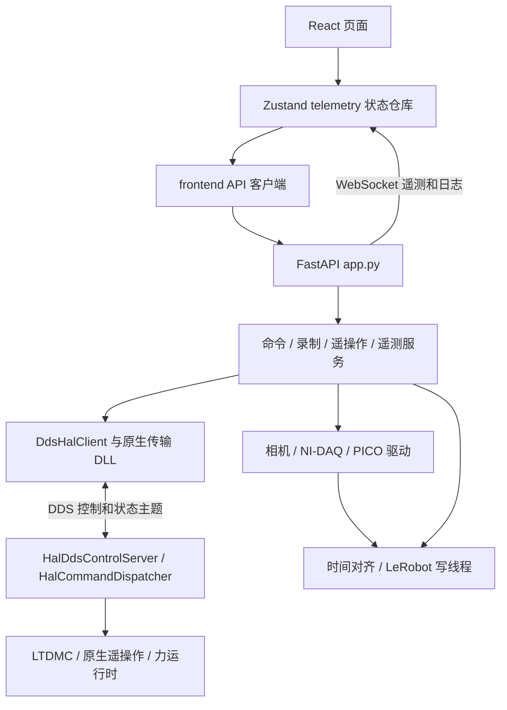
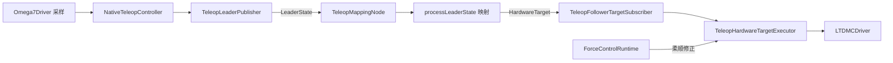

# 中文代码阅读指南

本指南按 `6d898c9` 的实现梳理。先理解数据与控制如何跨层流动，再进入设备算法；完整文件列表见 [SOURCE_INDEX.md](SOURCE_INDEX.md)。文件头的 01—08 是阅读阶段，阶段内无需逐行顺序通读。

## 1. 先看系统如何连接



浏览器通过后端 HTTP API 发出操作，通过 WebSocket 接收状态。Python 负责业务流程、配置、录制和对原生控制器的启停管理。真实 HAL 的控制面使用 DDS；HAL HTTP 当前仅提供 `/health`。主手实时采样、映射和运动执行位于 C++。

## 2. 推荐的第一遍阅读顺序

| 阶段 | 建议顺序 | 读完应能回答 |
| --- | --- | --- |
| 01 界面 | [main.tsx](../frontend/src/main.tsx) → [App.tsx](../frontend/src/App.tsx) → [AppLayout.tsx](../frontend/src/components/AppLayout.tsx) → [RecordPage.tsx](../frontend/src/views/RecordPage.tsx) | 页面如何挂载，连接在哪里建立，录制页面由哪些组件组成？ |
| 02 前端数据 | [types.ts](../frontend/src/types.ts) → [data.ts](../frontend/src/data.ts) → [API](../frontend/src/api/index.ts) → [telemetry.ts](../frontend/src/stores/telemetry.ts) | 配置、动作请求和遥测帧分别是什么，谁更新全局状态？ |
| 03 后端入口 | [schemas.py](../backend/core/schemas.py) → [app_factory.py](../backend/app_factory.py) → [app.py](../backend/app.py) → [defaults.py](../backend/core/defaults.py) → [config.py](../backend/core/config.py) | 服务由谁创建，路由如何调用它们，配置如何迁移和持久化？ |
| 04 业务 | [command_service.py](../backend/services/command_service.py) → [teleop_mapping.py](../backend/services/teleop_mapping.py) → [telemetry_hub.py](../backend/services/telemetry_hub.py) → [dataset_recorder.py](../backend/services/dataset_recorder.py) | 操作在哪检查，遥操作如何启停，训练帧如何组装？ |
| 05 传输 | [client.py](../backend/hal_client/client.py) → [protocol.py](../backend/hal_client/protocol.py) → [dds_types.py](../backend/hal_client/dds_types.py) → [dds_client.py](../backend/hal_client/dds_client.py) → [dds_runtime.py](../backend/hal_client/dds_runtime.py) → [原生绑定](../backend/native/appstation_fastdds_transport.cpp) | 状态怎样缓存，请求编号、应答、超时和重试怎样关联？ |
| 06 硬件 | [HalServer.cpp](../hal/src/HalServer.cpp) → [HalCommandDispatcher.cpp](../hal/src/HalCommandDispatcher.cpp) → [NativeTeleopController.h](../hal/include/NativeTeleopController.h) → [NativeTeleopController.cpp](../hal/src/NativeTeleopController.cpp) → [LTDMCDriver.cpp](../hal/src/LTDMCDriver.cpp) | 谁拥有驱动和线程，目标怎样进入运动卡，哪些条件会阻断执行？ |
| 07 测试 | [test_units.py](../backend/tests/test_units.py) → [test_operator_view.py](../backend/tests/test_operator_view.py) → [test_hal_dds_client.py](../backend/tests/test_hal_dds_client.py) → [test_teleop_mapping.py](../backend/tests/test_teleop_mapping.py) → [test_app.py](../backend/tests/test_app.py) | 哪些边界已有回归覆盖，怎样用最小输入理解服务行为？ |
| 08 部署 | [Start-App.cmd](../Start-App.cmd) → [launch-app.ps1](../scripts/launch-app.ps1) → [start-stack.ps1](../scripts/start-stack.ps1) → [start-hal.ps1](../scripts/start-hal.ps1) | 服务启动顺序、日志、候选二进制和依赖 DLL 如何管理？ |

C++ 模块优先读同名 `include/*.h` 的结构和公开方法，再读 `src/*.cpp`；长文件优先用编辑器符号面板定位，而不从第一行连续翻到底。

## 3. 按功能追踪调用链

### 手动控制

[SettingsView](../frontend/src/views/SettingsView.tsx) → [telemetry store](../frontend/src/stores/telemetry.ts) → [API](../frontend/src/api/index.ts) → [app.py](../backend/app.py) 的 `/api/motion/manual_axis_move` → [CommandService](../backend/services/command_service.py) → [DdsHalClient](../backend/hal_client/dds_client.py) → [HalCommandDispatcher](../hal/src/HalCommandDispatcher.cpp) → [LTDMCDriver](../hal/src/LTDMCDriver.cpp)。

配合 [manualMotionLimits.ts](../frontend/src/manualMotionLimits.ts)、[motion_limits.py](../backend/core/motion_limits.py) 和 [units.py](../backend/core/units.py) 查看步长、工作原点、软限位和脉冲单位。前端提示之外，后端与 HAL 还有执行侧检查。

### 遥操作

Python [TeleopMappingService](../backend/services/teleop_mapping.py) 管理连接、录制来源与原点切换；实时链路从 [HalServer](../hal/src/HalServer.cpp) 装配开始：



`dds_follower` 模式且三个 DDS 组件可用时接入此链路；否则仍有原生进程内执行路径。主手采样由运行中的原生控制器驱动。Python 文件名中的 mapping 不能理解为所有映射都在 Python 运行。

夹爪由 [GripperRouter](../backend/services/gripper_router.py) 统一选择 [NativeGripperAdapter](../backend/services/gripper_backend.py)。[gripper_rs485.py](../backend/drivers/gripper_rs485.py) 仍用于驱动测试和独立工具；追踪当前应用控制应先沿原生适配器进入 HAL。

### 力采样、安全与柔顺

[force_config.py](../backend/core/force_config.py) 校验配置，[start-hal.ps1](../scripts/start-hal.ps1) 按 PnP 身份解析 HKVL COM 口并注入运行配置。随后读 [HkvlForceProtocol](../hal/src/HkvlForceProtocol.cpp) → [HkvlForceDriver](../hal/src/HkvlForceDriver.cpp) → [ForceControlRuntime](../hal/src/ForceControlRuntime.cpp) → [ForceSafetyLatch](../hal/src/ForceSafetyLatch.cpp) / [ForceComplianceController](../hal/src/ForceComplianceController.cpp)。

安全检测使用方向对齐后的去皮值，柔顺使用滤波值。达到停机阈值 120% 时单帧触发；普通停机阈值需同一通道连续三帧达到。任一侧断连、缺样或超时也会锁存。恢复需双侧健康、数据新鲜、低于警告阈值并维持稳定窗口。阈值以当前配置为准，见 [ForceSafetyConfig](../hal/include/ForceSafetyLatch.h)。

柔顺修正当前叠加到 X/Z，最终仍经运动驱动限幅；实际执行量回传柔顺控制器。源码相关测试在 [ForceCoreTests.cpp](../hal/tests/ForceCoreTests.cpp)，Python 配置测试在 [test_force_config.py](../backend/tests/test_force_config.py)。NI-DAQ 使用独立的 [force_nidaq.py](../backend/drivers/force_nidaq.py) 路径。

### 数据录制与查看

[EpisodeControlPanel](../frontend/src/components/record/EpisodeControlPanel.tsx) → store → `/api/record/*` → [DatasetRecorderService](../backend/services/dataset_recorder.py)。长文件建议依次定位：

1. `start_session`、`save_episode`、`discard_episode`、`finish_session`：先理解会话和 episode 边界。
2. `TimedSample`、`TimedRingBuffer`：各来源样本的时间、缓存及最大对齐偏差。
3. `FrameAssembler.assemble`：按同一目标时间选取运动、力、夹爪与相机样本，构造 observation/action。
4. `LeRobotWriterThread`：通过单个队列串行处理帧与保存、清空、结束命令。
5. `RecordingQualityTracker`：理解迟到、时间偏差等质量统计。
6. `list_datasets`、`episode_detail`、`resolve_frame_image`：对应 [DatasetView](../frontend/src/views/DatasetView.tsx) 的列表、详情和图像回放。

相机来源继续读 [camera_opencv.py](../backend/drivers/camera_opencv.py) 与 [camera_capture_worker.py](../backend/workers/camera_capture_worker.py)。界面预览使用 MJPEG 流；[useLiveCameraSnapshot](../frontend/src/hooks/useLiveCameraSnapshot.ts) 是保留名称，应按其当前实现理解。

## 4. 最容易读错的约定

| 概念 | 当前实现 | 对照位置 |
| --- | --- | --- |
| 操作者侧与硬件侧 | 操作者 left 对应硬件 right，反向同理；不要仅凭变量 left/right 推断现场位置 | [operator_view.py](../backend/core/operator_view.py)、[data.ts](../frontend/src/data.ts) |
| 运动数组顺序 | 每侧 X、Y、Z、Roll、Pitch、Yaw；双侧运动状态共 12 维 | [units.py](../backend/core/units.py)、[HalTypes.h](../hal/include/HalTypes.h) |
| 训练状态维数 | 每侧 6 轴加 1 个夹爪，共 14 维 | [policy_bridge.py](../backend/services/policy_bridge.py) |
| 界面单位 | 平移 μm，旋转 degree；夹爪 mm | [units.py](../backend/core/units.py)、[gripper_backend.py](../backend/services/gripper_backend.py) |
| LeRobot 旋转单位 | 0.001 degree，与界面旋转量相差 1000 倍 | [test_units.py](../backend/tests/test_units.py)、[test_policy_bridge.py](../backend/tests/test_policy_bridge.py) |
| 时间戳 | Unix 时间用于跨界面显示；单调时钟用于间隔、对齐和超时 | [dds_types.py](../backend/hal_client/dds_types.py)、[dataset_recorder.py](../backend/services/dataset_recorder.py) |
| 测试与真实设备 | `make_hal_client` 选择 test 替身或 real DDS；前端还单独有 mockMode | [app.py](../backend/app.py)、[API](../frontend/src/api/index.ts) |
| 多入口共享遥操作 | 连接界面与录制有独立来源标识，停止一个来源不必然停止其余来源 | [teleop_mapping.py](../backend/services/teleop_mapping.py) |
| 当前实现与历史设计 | `docs/superpowers/` 是各次变更的设计/计划；现状以源码及测试为准 | [SOURCE_INDEX.md](SOURCE_INDEX.md) |

## 5. 查找方法和验证命令

在 VS Code 中用 `Ctrl+P` 跳转文件、`Ctrl+Shift+O` 查看本文件符号、`F12` 跳到定义、`Shift+F12` 查看引用。Python 动态调用和 C++ 原生接口有时无法直接跳转，可搜索函数名、API 路径或 DDS 主题名。仓库内可以用：

```powershell
rg -n 'manual_axis_move|manualAxisMove' frontend/src backend
rg -n 'processLeaderState|HardwareTarget' hal
rg -n 'request_id|command_request_policy' backend/hal_client hal/src
rg -n 'origin_mutation_locked|start_session|save_episode' backend
```

下列命令从仓库根目录执行。Python 环境需安装 [pyproject.toml](../backend/pyproject.toml) 中相应依赖；前端安装使用已有锁文件。

```powershell
backend/.venv/Scripts/python.exe -m pytest backend/tests -q
npm --prefix frontend run build
npm --prefix frontend test
```

这些测试与前端构建不会替代实机验收。`test_hal_source_contracts.py` 检查 C++ 源码文本约束；完整 HAL 还依赖本机 Windows C++ 工具链与 Fast-DDS/设备 SDK。LeRobot 数据集读写测试有额外依赖，缺失时可能跳过。

## 6. 哪些文件先不展开

- `frontend/node_modules/`、Python 虚拟环境、`hal/vendor/` 是安装依赖；不做逐文件注释。
- 根目录 `app-main-DKFfP-X-.js` 是构建压缩产物，应回到 `frontend/src/` 阅读源码。
- JSON 配置、锁文件、图片、二进制及 `hal/tests/fixtures/` 数据不插入注释，避免改变格式；作用见完整索引的补充表。
- `.specify/` 是规格工作流和扩展脚本，不参与运行时业务；保留原有说明。
- `codex-provider-sync/`、`paper/`、根目录 `output/` 为本地未跟踪内容，未纳入本次项目源码注释。其他工作树也未批量修改。
- [accept-hal-native-teleop.ps1](../scripts/accept-hal-native-teleop.ps1) 和 [diagnose-teleop-latency.ps1](../scripts/diagnose-teleop-latency.ps1) 已停用，执行会抛出迁移说明；[verify-hal-native-teleop-report.ps1](../scripts/verify-hal-native-teleop-report.ps1) 仍是离线报告校验工具。

新增或重命名源码时，请同时维护文件头职责和 [源码索引](SOURCE_INDEX.md)，入口或调用链改变时更新本指南。
