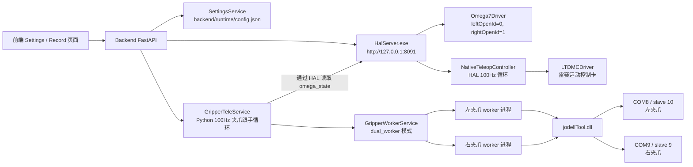

# 当前遥操作与夹爪控制策略

更新时间：2026-06-12

本文档记录当前工作区中的 AppStation M0 遥操作策略与夹爪策略。内容覆盖当前运行配置、源码入口、左右手/左右臂/左右夹爪线路、控制链路、日志证据和现场检查项，便于后续排查时不再从代码和日志里重新拼图。

## 先看结论

- 机械臂遥操作当前使用 HAL 原生控制器：`engine=hal_native`，`controlMode=incremental_position`，`mappingMode=direct`。
- 遥操作通道是有意交叉的：左 Omega.7 控制右臂，右 Omega.7 控制左臂。
- 夹爪也必须跟随交叉后的目标臂：左臂夹爪读取右 Omega.7 的夹爪开合量，右臂夹爪读取左 Omega.7 的夹爪开合量。
- 当前夹爪跟手的主路径是 Backend Python 的 `GripperTeleService` 加 `dual_worker` 双进程 Jodell 控制。HAL 原生 `tickGrippers()` 仍保留兼容字段，但当前不是主控路径。
- 这次日志里的左夹爪问题不是“没有生成目标”，而是目标已经生成，最终打开左夹爪串口时报 `COM8 open failed`。

## 源码与配置来源

| 内容 | 源码/配置位置 | 说明 |
| --- | --- | --- |
| 策略版本 | `backend/core/defaults.py:21`、`backend/runtime/config.json:535` | 当前为 `e2e_omega7_native_v29_stable_feel_lead_20260612`。 |
| 机械臂遥操作默认参数 | `backend/core/defaults.py:137-177` | v29 的速度、比例、死区、轴启用配置。 |
| 夹爪设备默认参数 | `backend/core/defaults.py:350-374` | COM 口、slave id、Jodell DLL、worker 模式。 |
| 夹爪跟手默认参数 | `backend/core/defaults.py:436-460` | gap 映射、源手映射、速度、死区、最小命令间隔。 |
| 运行配置 | `backend/runtime/config.json` | 本机运行时配置，不进入 git。 |
| 配置迁移 | `backend/core/config.py:757-779`、`backend/core/config.py:1006-1012` | 将旧的同侧夹爪映射迁回交叉映射。 |
| 前端默认配置 | `frontend/src/data.ts:575-648` | 保持 Settings UI 的默认值和后端一致。 |
| HAL 原生机械臂路由 | `hal/src/NativeTeleopController.cpp:741` | `swapTeleopChannels=true` 时进行左右通道交叉。 |
| Backend 夹爪跟手 | `backend/services/gripper_tele_service.py:18-367` | 当前夹爪跟手主实现。 |
| Jodell 双 worker | `backend/services/gripper_worker_service.py:20-226` | 每侧夹爪一个隔离 worker 进程。 |

## 操作线路

### 逻辑线路

| 操作者输入 | Open ID | 日志中观察到的设备 | 目标机械臂 | 运动控制线路 | 目标夹爪 |
| --- | ---: | --- | --- | --- | --- |
| 左 Omega.7 | `0` | `deviceId=1`，`serial=22025`，`leftHanded=true` | 右臂 | 控制卡 `0`，物理轴 `[2, 0, 5, 8, 1, 7]` | 右夹爪，`COM9`，slave `9` |
| 右 Omega.7 | `1` | `deviceId=0`，`serial=22821`，`leftHanded=false` | 左臂 | 控制卡 `1`，物理轴 `[0, 1, 3, 5, 4, 2]` | 左夹爪，`COM8`，slave `10` |

这条线路是刻意设计的，不是左右写反。

机械臂交叉由 HAL 原生代码完成：

```cpp
const Side targetSide = config_.swapTeleopChannels
    ? sideFromIndex(1 - sourceIndex)
    : sourceSide;
```

夹爪交叉由配置完成：

```json
{
  "leftSourceHand": "PhysicalRight",
  "rightSourceHand": "PhysicalLeft"
}
```

因此当前规则是：

| 目标侧 | 机械臂来源 | 夹爪来源 | 夹爪设备 |
| --- | --- | --- | --- |
| 左臂 | 右 Omega.7 | `PhysicalRight` | 左 Jodell 夹爪，`COM8`，slave `10` |
| 右臂 | 左 Omega.7 | `PhysicalLeft` | 右 Jodell 夹爪，`COM9`，slave `9` |

### 进程与通信线路



`scripts/start-hal.ps1` 启动 `HalServer.exe`，设置 `APPSTATION_HAL_PORT`，并把 Omega.7 打开参数写入环境变量：

```powershell
$env:APPSTATION_OMEGA7_LEFT_OPEN_ID = "$omegaLeftOpenId"
$env:APPSTATION_OMEGA7_RIGHT_OPEN_ID = "$omegaRightOpenId"
$env:APPSTATION_OMEGA7_SWAP_HANDS = if ($omegaSwapHands) { "true" } else { "false" }
$env:APPSTATION_JODELL_WORKER_EXE = "$workerRuntimeExe"
```

当前默认值：

| 项 | 值 |
| --- | --- |
| HAL 端口 | `8091` |
| 左 Omega.7 open id | `0` |
| 右 Omega.7 open id | `1` |
| `swapHands` | `false` |

## 机械臂遥操作策略

### 运行模式

| 参数 | 当前值 | 含义 |
| --- | --- | --- |
| `teleop.engine` | `hal_native` | Backend 下发一次原生 payload，HAL 负责实时循环。 |
| `controlMode` | `incremental_position` | Omega.7 位姿变化被转换为增量位置脉冲。 |
| `mappingMode` | `direct` | 使用直接语义轴映射。 |
| `loopHz` | 默认 `100` | HAL 原生循环周期约 10 ms；运行配置未写时使用默认值。 |
| `swapHands` | `false` | 驱动打开设备时不交换左右手。 |
| `swapTeleopChannels` | `true` | 目标机械臂交叉。 |
| `homeBeforeStart` | `true` | 启动遥操作前可回工作原点。 |
| `leftGravityCompensation` | `true` | 左 Omega.7 开启重力补偿。 |
| `rightGravityCompensation` | `true` | 右 Omega.7 开启重力补偿。 |

### 手感与稳定性参数

当前 v29 策略保留跟手响应，同时降低了更激进参数带来的不稳定风险。

| 参数 | 左臂 | 右臂 | 说明 |
| --- | ---: | ---: | --- |
| 平移总比例 | `1.0` | `1.0` | 平移整体倍率。 |
| 旋转总比例 | `1.0` | `1.0` | 旋转整体倍率。 |
| 轴输出比例 | `[0.60, 0.50, 0.375, 0.60, 0.08, 0.10]` | `[0.60, 0.50, 0.375, 0.60, 0.08, 0.001]` | 右臂 yaw 基本禁用。 |
| 启用轴 | `[true, true, true, true, true, true]` | `[true, true, true, true, true, false]` | 右臂 yaw 关闭。 |
| 平移死区 | `0.00002 m` | `0.00002 m` | 过滤极小输入。 |
| 旋转死区 | `0.03 deg` | `0.03 deg` | 过滤极小旋转输入。 |
| 平移输入阈值 | `0.00002 m` | `0.00002 m` | 连续增量触发阈值。 |
| 旋转输入阈值 | `0.03 deg` | `0.03 deg` | 连续增量触发阈值。 |
| 平移脉冲死区 | `2 pulse` | `2 pulse` | 忽略极小脉冲。 |
| 旋转脉冲死区 | `2 pulse` | `2 pulse` | 忽略极小脉冲。 |
| 平移最小有效脉冲 | `3 pulse` | `3 pulse` | 非零连续命令的最小输出。 |
| 旋转最小有效脉冲 | `3 pulse` | `3 pulse` | 非零连续命令的最小输出。 |
| 微小动作确认 tick | `0` | `0` | 不再额外等待多 tick 确认。 |
| 平移起步/最大速度 | `600 / 8000 um/s` | `600 / 8000 um/s` | 降低起步和最大速度，增加稳定性。 |
| 旋转起步/最大速度 | `1 / 12 deg/s` | `1 / 12 deg/s` | 降低旋转速度。 |
| 加减速时间 | `0.05 / 0.05 s` | `0.05 / 0.05 s` | 更平滑的运动曲线。 |

### 轴方向与脉冲系数

| 侧 | `impulseCoeff` | `directionSign` |
| --- | --- | --- |
| 左臂 | `[-5000000, -5000000, -10000000, 1667, 2500, -333.3333]` | `[1, -1, -1, 1, -1, -1]` |
| 右臂 | `[-5000000, 10000000, -5000000, 1667, -2500, 3333.333]` | `[1, 1, -1, 1, 1, 1]` |

### 机械臂控制流程

1. Backend 在 `TeleopMappingService._native_payload()` 中生成 HAL-native payload。
2. Backend 通过 `HalClient` 下发 `teleop.native.start`。
3. `NativeTeleopController::loop()` 按 `loopHz` 运行。
4. 每一帧读取两个 Omega.7 状态。
5. 通过 `swapTeleopChannels` 把源手映射到目标臂。
6. 计算增量脉冲，应用死区、最小脉冲、速度曲线和软限位。
7. 将目标发送给 `LTDMCDriver`。
8. 如果某只 Omega.7 逻辑断开、读取失败，或需要 clutch 但未按下，则停止对应目标臂并清空该侧增量状态。

关键源码：

| 源码 | 作用 |
| --- | --- |
| `backend/services/teleop_mapping.py:1700-1788` | 构建 HAL-native payload。 |
| `backend/services/teleop_mapping.py:578-591` | 下发 `teleop.native.start`。 |
| `hal/src/NativeTeleopController.cpp:686-715` | HAL 原生 100Hz 主循环。 |
| `hal/src/NativeTeleopController.cpp:741` | `swapTeleopChannels=true` 时左右目标臂交叉。 |
| `hal/src/NativeTeleopController.cpp:848` | 使用速度和加减速配置发送遥操作命令。 |
| `backend/app.py:309-314` | Backend 侧同样维护源手到目标臂的映射规则。 |

## 夹爪遥操作策略

### 当前主路径

当前夹爪跟手实际路径如下：

```text
Omega.7 夹爪 gap
  -> HAL /omega_state
  -> Backend GripperTeleService
  -> FollowGripper gap-to-target 映射
  -> GripperWorkerService dual_worker
  -> 每侧一个 worker 进程
  -> jodellTool.dll
  -> COM8 或 COM9
  -> Jodell slave 10 或 9
```

HAL 原生夹爪循环 `NativeTeleopController::tickGrippers()` 仍存在，但 `backend/services/teleop_mapping.py:1800-1802` 中 `_native_gripper_teleop_enabled()` 当前固定返回 `False`。这可以避免 Backend 夹爪跟手和 HAL 原生夹爪跟手同时控制同一组 Jodell 设备。

### 夹爪设备与 worker 参数

| 参数 | 当前值 | 说明 |
| --- | --- | --- |
| 左夹爪串口 | `COM8` | 左物理夹爪。 |
| 右夹爪串口 | `COM9` | 右物理夹爪。 |
| 左夹爪 slave id | `10` | Jodell 从站号。 |
| 右夹爪 slave id | `9` | Jodell 从站号。 |
| 波特率 | `115200` | Jodell RS485 通信。 |
| 行程 | `26 mm` | 用于 mm 与 raw 位置换算。 |
| 采样/控制模式 | `dual_worker` | 每侧一个隔离进程。 |
| `processWorkersEnabled` | `true` | 启用进程 worker。 |
| worker 命令超时 | `2.0 s` | 单次命令等待上限。 |
| stale sample 窗口 | `500 ms` | 超过该时间的采样视为旧值。 |
| Jodell DLL | `F:/E2EAPP_MicroMani/backend/vendor/jodell/jodellTool.dll` | 厂商 SDK。 |
| ICF 目标保护 | `true` | 避免夹得过死。 |
| 保护最小 gap | `1.02 mm` | 目标 gap 下限。 |

### 夹爪跟手参数

| 参数 | 当前值 | 说明 |
| --- | --- | --- |
| `enabled` | `true` | 遥操作连接、手动夹爪或录制时可启动跟手。 |
| `loopHz` | `100` | Python 跟手循环目标频率。 |
| `leftSourceHand` | `PhysicalRight` | 左夹爪读取右 Omega.7。 |
| `rightSourceHand` | `PhysicalLeft` | 右夹爪读取左 Omega.7。 |
| 左 gap 范围 | `0.0 - 25.0 mm` | Omega.7 输入 gap 范围。 |
| 右 gap 范围 | `0.0 - 25.0 mm` | Omega.7 输入 gap 范围。 |
| gap 反向 | 左右均 `false` | gap 越大，目标开口越大。 |
| 自动 gap 校准 | `true` | 观测范围超出配置范围时可扩展有效范围。 |
| 自动校准最小 span | `2.0 mm` | 观测跨度达到该值才可信。 |
| 自动校准 margin | `1.0 mm` | 配置范围外扩容边界。 |
| 跟手速度 | `255` | Jodell 跟手目标速度。 |
| 跟手力矩 | `1` | Jodell 跟手目标力矩。 |
| 位置死区 | `1 raw count` | 抑制极小目标变化。 |
| 最小命令间隔 | `20 ms` | 每侧限频。 |
| button fallback | `true` | gap 不可用时用按钮开/合。 |
| 运行时诊断日志 | 当前运行配置为 `true` | 默认值是 `false`，当前用于排查。 |

### gap 到目标位置的公式

Backend 源码：`backend/services/gripper_tele_service.py:46-135`。

```python
open_ratio = clamp((gap_mm - gap_min) / (gap_max - gap_min), 0.0, 1.0)
if gap_invert:
    open_ratio = 1.0 - open_ratio

target_mm = protected_gripper_target_mm_from_values(
    open_ratio * stroke_mm,
    stroke_mm,
    icf_target_protection_enabled,
    icf_target_min_gap_mm,
)
raw_position = round((1.0 - (target_mm / stroke_mm)) * 255)
```

含义：

- Omega.7 的 gap 越大，Jodell 目标开口越大。
- Jodell raw 位置是反向的：raw `0` 接近全开，raw `255` 接近闭合。
- ICF 保护开启时，目标 gap 不会低于 `1.02 mm`。

### 命令调度策略

Backend 源码：`backend/services/gripper_tele_service.py:294-335`。

当前策略是“左右独立、同侧合并最新目标”：

- 左右夹爪各自有独立命令任务。
- 某侧没有命令在执行时，新命令立即发出。
- 某侧已有命令在执行时，只保留该侧最新目标，旧 pending 目标被覆盖。
- 左侧失败不会阻塞右侧。
- 这样既保留跟手的连续感，又避免 worker 或串口命令堆积。

核心逻辑：

```python
def _queue_command(self, request):
    side = request[1]
    task = self._command_tasks.get(side)
    if task is not None and not task.done():
        self._pending_commands[side] = request
        return
    self._start_command_task(request)
```

这条策略直接对应当前问题：如果左侧 `COM8 open failed`，右侧 `COM9` 不再被左侧失败拖慢。

### 源手选择

Backend 源码：`backend/services/gripper_tele_service.py:361-377`。

`PhysicalLeft`、`LogicalLeft`、`left` 选择 HAL 返回的左 Omega.7；`PhysicalRight`、`LogicalRight`、`right` 选择 HAL 返回的右 Omega.7。当前运行配置使用物理源手：

```json
{
  "leftSourceHand": "PhysicalRight",
  "rightSourceHand": "PhysicalLeft"
}
```

这和机械臂交叉目标保持一致。

## 当前运行配置快照

以下内容来自 `backend/runtime/config.json`。

```json
{
  "teleop": {
    "strategyVersion": "e2e_omega7_native_v29_stable_feel_lead_20260612",
    "engine": "hal_native",
    "controlMode": "incremental_position",
    "mappingMode": "direct",
    "leftOpenId": 0,
    "rightOpenId": 1,
    "swapHands": false,
    "swapTeleopChannels": true,
    "leftTranslationScale": 1.0,
    "rightTranslationScale": 1.0,
    "leftRotationScale": 1.0,
    "rightRotationScale": 1.0,
    "leftAxisOutputScale": [0.60, 0.50, 0.375, 0.60, 0.08, 0.10],
    "rightAxisOutputScale": [0.60, 0.50, 0.375, 0.60, 0.08, 0.001],
    "leftEnabledAxes": [true, true, true, true, true, true],
    "rightEnabledAxes": [true, true, true, true, true, false],
    "translationDeadzone": 0.00002,
    "rotationDeadzone": 0.03,
    "translationInputEpsilon": 0.00002,
    "rotationInputEpsilon": 0.03,
    "translationStartVelocityUmS": 600.0,
    "translationMaxVelocityUmS": 8000.0,
    "rotationStartVelocityDegS": 1.0,
    "rotationMaxVelocityDegS": 12.0,
    "motionProfileAccSec": 0.05,
    "motionProfileDecSec": 0.05,
    "continuousMicroConfirmTicks": 0
  },
  "gripper": {
    "leftPort": "COM8",
    "rightPort": "COM9",
    "leftSlaveId": 10,
    "rightSlaveId": 9,
    "strokeMm": 26,
    "sampleMode": "dual_worker",
    "processWorkersEnabled": true,
    "icfTargetProtectionEnabled": true,
    "icfTargetMinGapMm": 1.02
  },
  "gripperTeleop": {
    "enabled": true,
    "loopHz": 100,
    "leftSourceHand": "PhysicalRight",
    "rightSourceHand": "PhysicalLeft",
    "leftGapMinMm": 0.0,
    "leftGapMaxMm": 25.0,
    "rightGapMinMm": 0.0,
    "rightGapMaxMm": 25.0,
    "positionDeadbandCounts": 1,
    "minCommandIntervalMs": 20,
    "gripSpeed": 255,
    "gripTorque": 1,
    "buttonFallback": true,
    "autoGapCalibration": true
  }
}
```

## 当前日志证据

来源：`C:\Users\Administrator\Downloads\appstation-m0-1781248875016.log`。

### 两只 Omega.7 均已连接

日志显示两只 Omega.7 都是物理连接和逻辑连接：

- 左输入：`requestedId=0`，`deviceId=1`，`serial=22025`，`leftHanded=true`。
- 右输入：`requestedId=1`，`deviceId=0`，`serial=22821`，`leftHanded=false`。

### 右夹爪命令成功

```text
right target=11.85mm raw=139 -> runWithParam COM9, slave=9, pos=139, speed=255, torque=1, ret=1
right target=20.40mm raw=55 -> runWithParam COM9, slave=9, pos=55, speed=255, torque=1, ret=1
```

说明右夹爪 `COM9/slave=9` 可以收到 Jodell 命令并返回成功。

### 左夹爪目标生成成功，但 COM8 打开失败

```text
left target=1.42mm raw=241 -> COM8 open failed
left target=1.51mm raw=240 -> COM8 open failed
left target=1.34mm raw=242 -> COM8 open failed
```

解释：

- 左夹爪不是没有源手输入，也不是没有目标计算。
- 问题发生在设备通信层：`COM8` 无法打开。
- 应优先检查 COM8 是否被占用、线缆/供电、Windows 设备管理器端口号、Jodell worker 状态，而不是继续改夹爪映射策略。

## 关键源码片段

### 默认策略版本与交叉夹爪源手

```python
ICF_TELEOP_STRATEGY_VERSION = "e2e_omega7_native_v29_stable_feel_lead_20260612"

"swapTeleopChannels": True,
"leftAxisOutputScale": [0.60, 0.50, 0.375, 0.60, 0.08, 0.10],
"rightAxisOutputScale": [0.60, 0.50, 0.375, 0.60, 0.08, 0.001],

"leftSourceHand": "PhysicalRight",
"rightSourceHand": "PhysicalLeft",
```

来源：`backend/core/defaults.py`。

### 配置迁移：同侧夹爪映射会被改回交叉映射

```python
if (
    gripper_teleop.get("leftSourceHand") == "PhysicalLeft"
    and gripper_teleop.get("rightSourceHand") == "PhysicalRight"
):
    gripper_teleop["leftSourceHand"] = "PhysicalRight"
    gripper_teleop["rightSourceHand"] = "PhysicalLeft"
```

来源：`backend/core/config.py:1006-1010`。

### Backend 夹爪调度：同侧只保留最新目标

```python
if task is not None and not task.done():
    self._pending_commands[side] = request
    return
self._start_command_task(request)
```

来源：`backend/services/gripper_tele_service.py:294-301`。

### HAL 机械臂路由：交叉目标臂

```cpp
const Side sourceSide = sideFromIndex(sourceIndex);
const Side targetSide = config_.swapTeleopChannels ? sideFromIndex(1 - sourceIndex) : sourceSide;
```

来源：`hal/src/NativeTeleopController.cpp:739-741`。

### HAL 原生夹爪路由：兼容存在，但不是当前主路径

```cpp
const int sourceIndex = gripperSourceIndex(targetIndex);
const auto& hand = hands[sourceIndex];
```

来源：`hal/src/NativeTeleopController.cpp:1366-1367`。

```cpp
if (source.find("right") != std::string::npos) {
  return 1;
}
if (source.find("left") != std::string::npos) {
  return 0;
}
return targetIndex;
```

来源：`hal/src/NativeTeleopController.cpp:1509-1520`。

## 验证命令

修改遥操作或夹爪策略后，至少运行下面两条：

```powershell
backend\.venv\Scripts\python.exe -m pytest backend\tests\test_gripper_tele_service.py backend\tests\test_hardware_defaults.py backend\tests\test_teleop_mapping.py backend\tests\test_hal_source_contracts.py -q
```

本文档更新时的结果：`190 passed`。

```powershell
npm.cmd run typecheck
```

本文档更新时的结果：`tsc -b` 退出码为 `0`。

## 现场复测清单

1. 启动 HAL 和 backend。
2. 确认 `/health` 中 `ltdmc_ok=true`、`omega7_ok=true`。
3. 确认 `/api/settings` 中 `swapTeleopChannels=true`。
4. 确认 `/api/settings` 中 `leftSourceHand=PhysicalRight`、`rightSourceHand=PhysicalLeft`。
5. 移动左 Omega.7，确认右臂响应。
6. 移动右 Omega.7，确认左臂响应。
7. 捏合/松开左 Omega.7，确认右夹爪 `COM9/slave=9` 跟随。
8. 捏合/松开右 Omega.7，确认左夹爪 `COM8/slave=10` 跟随。
9. 如果左夹爪仍失败，优先检查 COM8 端口占用、线缆、供电、设备管理器端口分配和 worker 状态。

## 修改注意事项

- 不要在 `swapTeleopChannels=true` 时把 `leftSourceHand/rightSourceHand` 改回同侧；否则夹爪不会跟随对应目标臂。
- 不要同时启用 HAL 原生夹爪跟手和 Backend `GripperTeleService`，否则两套循环会竞争同一组 Jodell 设备。
- `positionDeadbandCounts=1` 与 `minCommandIntervalMs=20` 是当前跟手顺滑度和稳定性的平衡点，除非现场确认命令过密，否则不要轻易增大。
- `COM8 open failed` 是硬件/串口/worker 通信层问题；策略层已经能生成左夹爪目标。
