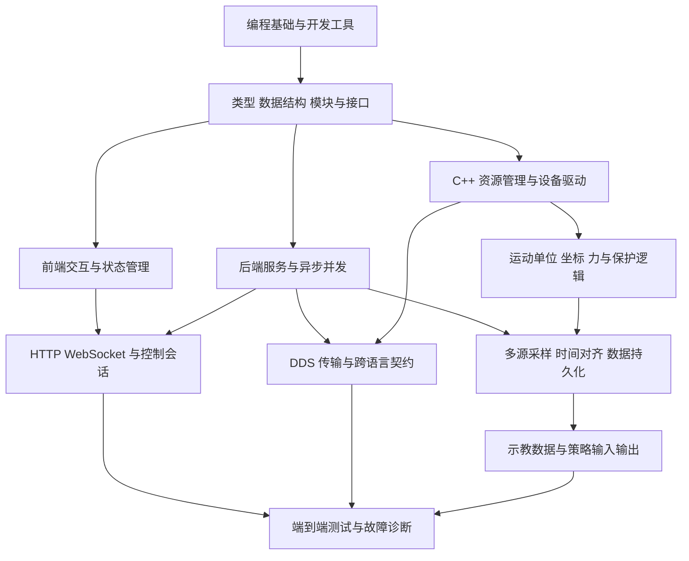
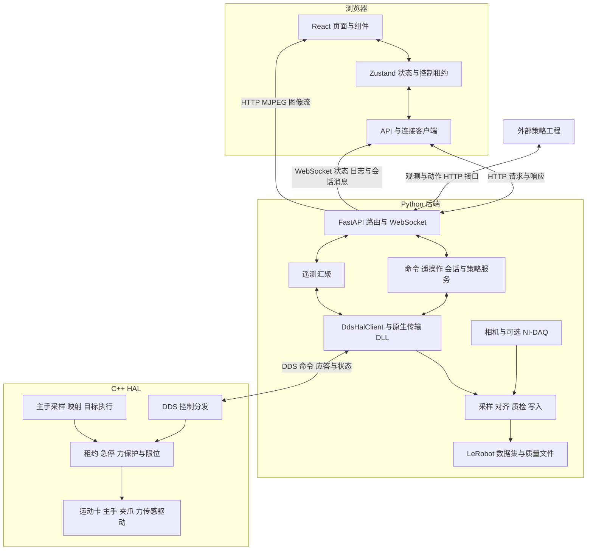
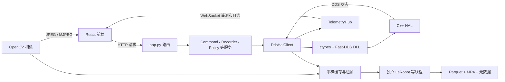
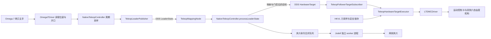
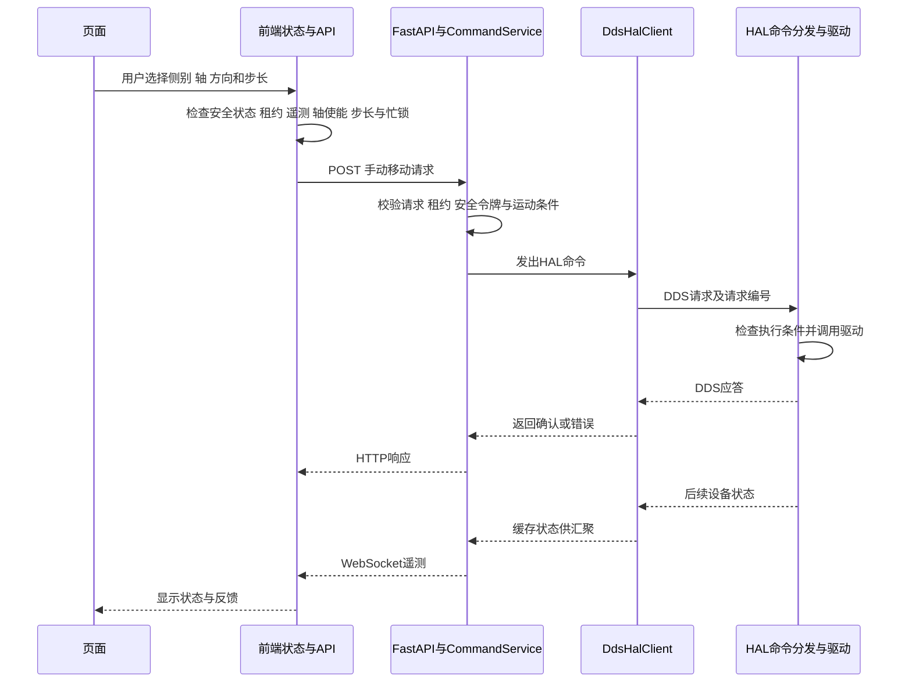
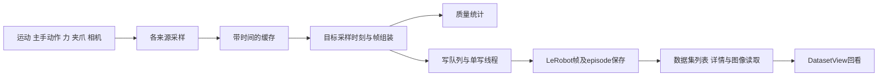

# MicroMani 微装配数据采集平台知识框架与学习路线

本平台需要掌握的知识可以按一条业务链组织：**操作者发出意图，软件把意图转换为受约束的设备动作，传感器返回观测，采集系统把观测与动作组织成数据，后续策略再通过受保护的接口使用这些数据。** React、FastAPI、DDS、C++ 和 LeRobot 分别承担这条链上的不同职责。

本文面向希望理解平台原理并逐步具备开发能力的学习者。它同时回答四个问题：系统怎样组成、为什么采用这些技术、代码与知识点怎样对应、按什么顺序学习和验证。

**版本基准：2026 年 9 月 17 日当前本地工作区。** 包括工作区已有的未提交改动。技术版本按依赖文件的声明说明，不把版本范围当成实际安装版本；“选型理由”是结合本项目职责作出的工程分析，不冒充原作者的历史决策。本文完成了静态源码核对，未启动设备、执行运动或开展性能测量。

逐文件定位见配套的[源码知识索引](<D:/E2EAPP_MicroMani/docs/平台源码知识索引.md>)。原有[代码阅读指南](<D:/E2EAPP_MicroMani/docs/CODE_READING_GUIDE.md>)可辅助导航；与当前代码不一致的旧说明，在本文相关章节中单独指出。

## 阅读导航

- [1 学习目标与知识之间的关系](#k1)
- [2 平台总体框架与当前能力边界](#k2)
- [3 技术选型与基础知识](#k3)
- [4 前端知识体系](#k4)
- [5 后端与数据采集知识体系](#k5)
- [6 HAL 与硬件控制知识体系](#k6)
- [7 跨层调用链与数据契约](#k7)
- [8 测试 构建 启动与排错](#k8)
- [9 分阶段学习路线与综合练习](#k9)
- [10 官方资料与阅读方法](#k10)

<a id="k1"></a>

## 1 学习目标与知识之间的关系

### 1.1 学会解释一个完整动作

以“界面上点击一次手动移动”为例，真正理解它需要能回答：按钮如何产生事件，输入如何校验，请求发到哪里，谁判断当前能否运动，单位怎样转换，哪一层接触厂商 SDK，成功应答代表什么，实际位置怎样回到界面，以及通信中断后谁停止运动。

因此，学习顺序宜先沿完整功能纵向贯通，再横向扩展技术细节。只学习框架 API，容易会写页面却不知道命令是否真正执行；只看运动算法，也容易忽略时间戳、失联、数据格式与记录可靠性。



### 1.2 三种学习深度

| 深度 | 需要达到的能力 | 建议先完成的任务 |
| --- | --- | --- |
| 理解系统 | 能画出模块图、说清命令和数据流向、区分界面值与实测值 | 读第 2、3、7 章并完成一条调用链笔记 |
| 独立开发 | 能改一个字段或页面，覆盖生产者、传输、消费者和测试 | 读对应技术章节，完成带替身的局部练习 |
| 研究与优化 | 能定义误差、延迟、质量及失败指标，设计可重复的对比实验 | 深入采集、控制与并发，完成第 9 章综合练习 |

“完整知识框架”指覆盖这些依赖关系与平台自有模块，不要求先精通所有第三方库内部实现。第一遍不需要逐行读虚拟环境、`node_modules`、设备厂商二进制或生成文件。

<a id="k2"></a>

## 2 平台总体框架与当前能力边界

### 2.1 三个主要运行层

| 层 | 在哪里运行 | 核心职责 | 不宜误解成 |
| --- | --- | --- | --- |
| 浏览器前端 | 浏览器中的 JavaScript | 页面、交互、配置编辑、遥测呈现、连接状态与控制入口 | 负责高频运动控制的实时控制器 |
| Python 后端 | Uvicorn/FastAPI 进程及其工作线程或可选子进程 | 配置、业务流程、会话、录制、遥测汇聚、策略桥接 | 一个接口返回成功就证明硬件到位 |
| C++ HAL | Windows 原生进程和设备相关工作线程/进程 | 厂商 SDK、遥操作采样与映射、运动执行、力运行时及执行保护 | 已取得硬实时或功能安全认证的系统 |

HAL 是 Hardware Abstraction Layer，即硬件抽象层。它把具体设备 API 收敛为平台可使用的控制与状态接口。项目在本机有多个进程边界，但不必把它理解为云端微服务系统。



这张图表示职责与信息方向，不表示所有箭头都在同一线程中同步运行。特别是相机预览、录制采样和运动控制各有自己的节奏。

### 2.2 目录在架构中的位置

| 目录 | 应学习的内容 | 典型入口 |
| --- | --- | --- |
| `frontend/src/views` | 页面如何组合功能 | [RecordPage.tsx](<D:/E2EAPP_MicroMani/frontend/src/views/RecordPage.tsx>) |
| `frontend/src/components` | 复用控件、业务组件、错误边界 | [AppLayout.tsx](<D:/E2EAPP_MicroMani/frontend/src/components/AppLayout.tsx>) |
| `frontend/src/stores`、`api` | 状态、连接、命令与遥测 | [telemetry.ts](<D:/E2EAPP_MicroMani/frontend/src/stores/telemetry.ts>)、[API](<D:/E2EAPP_MicroMani/frontend/src/api/index.ts>) |
| `backend/core` | 数据模型、默认值、配置与单位等共享规则 | [schemas.py](<D:/E2EAPP_MicroMani/backend/core/schemas.py>) |
| `backend/services` | 业务流程、状态转换、录制与策略边界 | [app_factory.py](<D:/E2EAPP_MicroMani/backend/app_factory.py>) |
| `backend/drivers`、`workers` | Python 设备接入及可选进程隔离 | [camera_opencv.py](<D:/E2EAPP_MicroMani/backend/drivers/camera_opencv.py>) |
| `backend/hal_client`、`native` | Python 至 C++ 的通信与原生绑定 | [dds_runtime.py](<D:/E2EAPP_MicroMani/backend/hal_client/dds_runtime.py>) |
| `hal/include`、`src`、`dds` | C++ 接口、实现与通信类型 | [HalServer.cpp](<D:/E2EAPP_MicroMani/hal/src/HalServer.cpp>) |
| `scripts` | 构建、启动、部署、诊断和数据工具 | [start-stack.ps1](<D:/E2EAPP_MicroMani/scripts/start-stack.ps1>) |
| 各层测试目录或测试文件 | 行为契约、拒绝路径、回归场景 | [源码知识索引](<D:/E2EAPP_MicroMani/docs/平台源码知识索引.md>) |

### 2.3 先区分五类“事实”

1. **代码中的实现**：某个函数确实执行了字段转换、发送或写入。
2. **默认配置**：代码默认选择某驱动，不代表现场运行配置一定相同。
3. **界面展示**：文案、初始值和演示曲线，不一定来自传感器或模型。
4. **测试证据**：在替身、样本或特定构建条件下满足断言。
5. **实机结论**：需要现场配置、测量条件和实验记录支持。

本次阅读中需要特别注意的当前状态如下。

| 容易形成的印象 | 当前源码可支持的结论 | 证据入口 |
| --- | --- | --- |
| 前端采用 Ant Design | 当前依赖未列 `antd`，主要使用自建 `ui.tsx` 与 CSS；旧流程和分包配置有残留说明 | [package.json](<D:/E2EAPP_MicroMani/frontend/package.json>)、[ui.tsx](<D:/E2EAPP_MicroMani/frontend/src/components/ui.tsx>) |
| `npm run dev` 必然提供热更新 | 当前脚本先构建，再用自有静态服务器提供 `dist` | [package.json](<D:/E2EAPP_MicroMani/frontend/package.json>) |
| 当前力源必然是历史硬件清单中的 Nano-17/NI-DAQ | 当前默认 `force.source` 是 `hkvl_serial`；另有 NI-DAQ 标定采样实现。实际接线仍需运行配置与实物核对 | [defaults.py](<D:/E2EAPP_MicroMani/backend/core/defaults.py>)、[force_nidaq.py](<D:/E2EAPP_MicroMani/backend/drivers/force_nidaq.py>) |
| 模型显示 running 即完成模型加载 | `PolicyService` 的登记与状态切换本身没有加载权重和执行神经网络推理 | [policy_service.py](<D:/E2EAPP_MicroMani/backend/services/policy_service.py>) |
| 微调页面已经实现训练 | 当前微调服务创建 `planned` 任务；真实训练循环不在此实现中 | [policy_service.py](<D:/E2EAPP_MicroMani/backend/services/policy_service.py>) |
| 自动页面的频率和延迟都是实测值 | 存在固定文案和计算展示，部分算法/模式选项只保存在页面本地状态 | [AutoView.tsx](<D:/E2EAPP_MicroMani/frontend/src/views/AutoView.tsx>) |
| 录制文件包含所有原始高频流 | 当前主要输出对齐训练帧和 episode 级质量统计，不能据此宣称保存了全部原始流和逐帧质量掩码 | [dataset_recorder.py](<D:/E2EAPP_MicroMani/backend/services/dataset_recorder.py>) |
| Fast-DDS 使用 ROS 安装目录，所以项目就是 ROS 2 节点系统 | 链接路径提供 Fast-DDS 库；当前控制通路需要按原生 DDS 实现理解 | [CMakeLists.txt](<D:/E2EAPP_MicroMani/hal/CMakeLists.txt>) |

<a id="k3"></a>

## 3 技术选型与基础知识

### 3.1 技术不是孤立清单

下表的理由来自当前职责分工。理解取舍比记住名称更重要。

| 技术 | 项目声明或使用情况 | 它解决的问题 | 需要同时理解的代价或限制 |
| --- | --- | --- | --- |
| TypeScript | `^6.0.3` | 对复杂配置、遥测和动作请求进行静态类型约束 | 类型在运行时消失，外部 JSON 仍需校验 |
| React / React DOM | `^18.3.1` | 用状态描述页面并复用交互组件 | 闭包、Effect 清理和渲染频率需要管理 |
| React Router | `^6.30.3` | 页面路由、布局与导航 | 路由切换不应意外重复创建控制连接 |
| Zustand | `^5.0.12` | 多页面共享实时状态及操作入口 | 大仓库会增加耦合，选择器和更新粒度影响性能 |
| Vite | `^8.0.10` | 编译打包、资源处理和按需分包 | 构建配置与真正启动命令需要分别阅读 |
| Python | `>=3.12` | 业务编排、数据处理与设备周边生态 | 同步 SDK 和耗时任务可能阻塞事件循环 |
| FastAPI / Starlette / Uvicorn | 分别声明 `>=0.137.1` / `>=1.0.1` / `>=0.32.0` | API 框架、ASGI 能力与服务器运行 | 异步路由不自动使内部所有代码非阻塞 |
| Pydantic | `>=2.10.0` | 配置与请求模型解析、类型约束、序列化 | 结构合法不等于设备状态允许执行 |
| C++20 | CMake 声明 | 原生 SDK、线程与硬件访问 | 内存/资源生命周期、ABI、锁和错误边界更复杂 |
| Fast-DDS / Fast-CDR | CMake 链接 2.14 / 2.2 库名 | 发布订阅、命令状态分离、序列化 | QoS、线程阻塞、超时与消息语义仍需设计 |
| OpenCV | `>=4.10.0` | 相机采集、图像转换和编码 | USB 带宽、相机驱动、曝光与帧缓存影响时序 |
| LeRobot dataset | 可选依赖 `>=0.5.2` | 以训练可消费的方式组织状态、动作、图像和片段 | 数据格式兼容不保证动作标签和时间对齐正确 |
| pytest / Vitest / Testing Library | 各层开发依赖 | 自动复现边界与回归行为 | 替身测试不覆盖真实设备时延和机械风险 |

版本声明来源：[前端依赖](<D:/E2EAPP_MicroMani/frontend/package.json>)、[后端依赖](<D:/E2EAPP_MicroMani/backend/pyproject.toml>)、[HAL 构建](<D:/E2EAPP_MicroMani/hal/CMakeLists.txt>)。`^` 与 `>=` 表示允许范围，前端精确依赖解析还应查看锁文件。本文没有要求升级任何依赖。

### 3.2 三种语言怎样执行

| 源文件 | 变成什么 | 在哪里执行 | 调试时先看什么 |
| --- | --- | --- | --- |
| `.ts`、`.tsx`、`.css` | 浏览器可加载的 JS/CSS 与静态资源 | 浏览器；Node 用于构建和提供静态文件 | Console、Network、React 状态、生成包对应源码 |
| `.py` | Python 解释器执行的模块与函数 | 后端进程、线程、可选工作进程 | Traceback、日志、协程任务及外部调用耗时 |
| `.h`、`.cpp` | 编译链接后的 `.exe` / `.dll` | Windows 原生进程 | 编译/链接错误、DLL 加载、线程、驱动返回码 |

`.h` 描述类型与接口，`.cpp` 实现行为。Python 的类型标注通常用于可读性与静态检查，Pydantic 等才在特定边界执行运行时验证。TypeScript 的 `as SomeType` 是类型断言，不会替你检查服务端 JSON 的真实性。

### 3.3 编程基础对应到平台问题

| 基础概念 | 在本平台中的具体意义 | 入门练习 |
| --- | --- | --- |
| 函数、对象、模块、导入 | 把设备读取、业务判断、页面显示分开 | 画出一个文件的输入、输出和依赖 |
| 数组、字典、集合、队列 | 轴状态、配置树、遥操作来源、待写帧 | 对 12 维数组做边界检查；模拟有限长度队列 |
| 可变对象与不可变更新 | UI 是否检测到变化，配置是否被意外共享修改 | 比较原地修改与创建新对象的结果 |
| Promise、协程、`await` | 请求等待期间还要处理界面或其他连接 | 在替身中加入延迟，观察并发请求行为 |
| 线程、进程、锁 | 隔离阻塞 SDK，保护共享状态，划分崩溃边界 | 用计数器演示竞态，再使用明确同步方式 |
| 超时、取消、幂等 | 请求超时后，设备可能已执行；重复运动可能累计 | 把“未发出”“已发出未确认”“确认失败”分开记录 |
| 生命周期 | 相机、串口、DLL、订阅和线程都需要释放 | 为获取资源画出对应释放路径 |
| 状态机 | 连接、录制、控制租约、急停各有不同状态 | 写出允许转换和禁止转换的表 |
| 时间与数值误差 | 帧对齐、陈旧判断、单位与浮点比较 | 区分 Unix 时间、单调时间、帧索引和频率 |

### 3.4 必要的数学与实验基础

- **线性代数**：向量、矩阵、坐标变换，用来理解轴映射与力标定；矩阵尺寸正确还不够，输入顺序和单位也必须正确。
- **微积分与控制基础**：速度是位移变化率，离散控制使用实际采样间隔；积分、滤波、饱和和延迟会改变系统响应。
- **概率统计**：平均值、标准差、分位数、最大值、重复实验。平均时延小不能掩盖偶发的大延迟。
- **信号处理**：采样、混叠、滤波、重采样与插值。低通滤波可减小噪声，也会引入响应延迟。
- **实验设计**：保持比较条件一致，区分传感器误差、时间对齐误差、机械定位误差与模型误差。

基础数学用于解释代码与设计实验，不意味着当前仓库已经实现完整机器人动力学、通用逆运动学或硬件同步系统。

### 3.5 用设计方法理解目录结构

这些概念用于解释已有代码的组织方式，不表示仓库完整采用某一套架构规范。

| 设计方法 | 平台中的具体对应 | 为什么有助于理解 |
| --- | --- | --- |
| 分层与职责分离 | 页面交互 → 后端业务 → HAL 执行 | 修改页面布局不应改变驱动单位；换设备优先从接口和驱动边界考虑 |
| 组合与依赖注入 | `create_services` 构造服务并传入依赖 | 可以把真实 HAL 换成测试替身；构造参数显示依赖方向 |
| 适配器与接口契约 | `HalClient`、`NativeGripperAdapter`、相机封装 | 对外提供稳定操作，同时在内部处理不同 SDK 的细节 |
| 发布订阅 | DDS topic、WebSocket 遥测、Zustand 订阅 | 状态发布者不必知道所有消费者；消费者仍需判断新鲜度 |
| 状态机 | 录制片段、控制租约、命令确认 | 同一个操作在不同状态下具有不同合法性和结果 |
| 生产者与消费者 | 源采样、帧组装、写线程与有限队列 | 各阶段可以有不同速度，但必须处理积压与退出顺序 |
| 快照与版本 | 配置快照、原点、generation、请求编号 | 记录一项操作依据的上下文，防止旧结果污染新状态 |
| 所有权与资源生命周期 | Effect 清理、Python shutdown、C++ RAII | 谁创建连接或线程，谁负责释放，失败时也应能回收 |

阅读结构时不要只寻找“某个设计模式”。先问一个状态归谁管理、一项判断在哪个边界做、一个资源由谁释放，再看当前分层能否把责任说清楚。

### 3.6 微装配领域需要补充的知识

平台软件之外，还应学习以下领域知识；这是一份后续知识清单，并非声称这些算法均已在仓库实现。

| 领域 | 核心问题 | 与平台代码的连接点 |
| --- | --- | --- |
| 精密运动与计量 | 分辨率、精度、重复性、回差、漂移有什么区别；控制器读数能否代表末端实际位置 | 脉冲转换、工作原点、限位、标定与定位实验 |
| 显微视觉 | 视场、像素标定、工作距离、景深、曝光、畸变与遮挡如何影响观测 | 相机角色、配置、图像尺寸、采集缓存与质量统计 |
| 坐标与标定 | 主手、机构、相机、工件、力传感器各用什么坐标系 | 左右映射、轴方向、变换矩阵、配置与标定快照 |
| 接触与力测量 | 噪声、零漂、去皮、力/力矩单位与安装方向；滤波延迟如何影响接触判断 | 力驱动、标定、柔顺叠加、保护锁存 |
| 遥操作与人机交互 | 缩放、离合、死区、速度、延迟、反馈怎样影响示教质量 | 原生遥操作映射、控制状态、录制动作标签 |
| 数据与泛化评估 | 工件型号、尺寸、材质/纹理、装夹、操作者和任务阶段怎样记录与划分 | episode 元数据、配置版本、质量标签、训练/测试划分 |

科研中的“通用”应拆成可验证范围：设备接入是否可扩展、不同任务能否复用采集流程、数据语义是否一致、模型是否在未见条件下表现稳定。这四个问题需要不同证据，不能仅用平台可以录制数据来证明模型已具备跨型号泛化能力。

<a id="k4"></a>

## 4 前端知识体系

### 4.1 前端在平台中负责什么

浏览器负责显示设备状态、收集操作者输入、管理交互流程和发送请求；后端与 HAL 负责业务、设备通信及执行。页面中的“已点击”“请求已返回”“设备已确认”是三个不同事实。理解这个区别，是学习本平台最重要的一步。

```text
main.tsx → App.tsx → BrowserRouter → AppLayout → 当前业务页面
                                         ├─ 导航、全局状态、日志、急停
                                         └─ 组件与 hook
组件事件 → Zustand action 或 api/index.ts → HTTP → 后端
后端 → WebSocket → 校验/租约/命令确认 → Zustand → 订阅者重渲染
后端相机 → HTTP MJPEG →                    （独立图像通道）
```

前端没有直接调用运动控制卡 SDK。不要把浏览器 WebSocket、后端到 HAL 的通信，以及相机视频流当成同一条通道；前端也不是精密运动实时循环的执行者。

### 4.2 当前技术选型与版本

以下是 [package.json](<D:/E2EAPP_MicroMani/frontend/package.json>) 的**声明版本范围**，不是现场设备能力，也不等于当前安装版本。`^` 表示 npm 的兼容版本范围，具体依赖解析还要看 [package-lock.json](<D:/E2EAPP_MicroMani/frontend/package-lock.json>)。

| 库/工具 | 声明版本 | 当前职责及选型理解 |
|---|---|---|
| React / React DOM | 均 `^18.3.1` | 组件描述 UI，React DOM 将它提交到浏览器 DOM；适合拆分多页面、共享状态视图，这是适用性解释，并非开发历史记录 |
| react-router-dom | `^6.30.3` | BrowserRouter、Route、Outlet、NavLink 管理页面和导航；URL 本身记录当前页面与设置定位 |
| Zustand | `^5.0.12` | 共享遥测、配置、录制和控制状态；组件可以只订阅需要的字段 |
| @tanstack/react-virtual | `^3.13.24` | 日志列表虚拟滚动，减少长列表 DOM 数量 |
| lucide-react | `^1.11.0` | 图标组件 |
| dayjs | `^1.11.20` | 顶栏时间格式化 |
| clsx | `^2.1.1` | 声明了条件类名工具；本次 `src` 检索未见导入，不能将依赖清单等同实际使用清单 |
| TypeScript | `^6.0.3` | 编译期检查接口、状态与参数；类型不会自动验证网络 JSON |
| Vite / @vitejs/plugin-react | `^8.0.10` / `^6.0.1` | JSX 转换与应用构建；当前配置使用 Rolldown 输出分包项 |
| Vitest / jsdom | `^4.1.5` / `^29.0.2` | 单元/组件测试与模拟 DOM 环境 |
| Testing Library | react `^16.3.2`、dom `^10.4.1`、jest-dom `^6.9.1`、user-event `^14.6.1` | 通过可见文字、角色、事件检查用户可观察行为 |
| Playwright | `^1.59.1` | 浏览器视觉检查脚本 |
| ESLint 相关 | eslint `^10.2.1`、@eslint/js `^10.0.1`、typescript-eslint `^8.58.2`、react-hooks `^7.1.1`、react-refresh `^0.5.2`、globals `^17.5.0` | 静态规则与 Hooks 用法检查 |
| 类型声明包 | @types/node `^24.12.2`、@types/react `^18.3.28`、@types/react-dom `^18.3.7` | 为第三方 API 提供 TypeScript 类型 |

当前 UI 采用 [components/ui.tsx](<D:/E2EAPP_MicroMani/frontend/src/components/ui.tsx>) 自建的 `UiButton`、`UiTag`、`UiTabs` 等组件和 [index.css](<D:/E2EAPP_MicroMani/frontend/src/index.css>)。当前 package.json 没有 Ant Design，源码检索也未见 antd 导入；共享流程仍提到 Ant Design，Vite 仍保留 antd 分包判断，属于与当前代码不完全一致的内容。当前曲线使用 Canvas，不应按旧资料写成 ECharts。

本地控件及 Canvas 注释明确提到减少首屏依赖和高频图表开销；它们说明设计意图，不能证明性能提高了多少。CSS 使用变量统一颜色、圆角、阴影，以 Flex/Grid 等布局组织页面；浏览器样式按层叠规则生效，阅读大 CSS 文件要检查后面是否覆盖前面的同名规则。

### 4.3 学懂 JavaScript、TypeScript 与 React 的必要基础

**JavaScript 先抓对象、函数和异步。** 遥测是对象，多个轴是数组，按钮回调是函数。`map` 把数据转为组件，`filter` 选择日志，`...state` 创建新对象。`async/await` 等待 Promise，不会让网络变成同步，也不能保证先发请求先返回。因此本项目大量使用 `requestId`、`generation`、`cancelled`：旧请求可以返回，但失去继续修改当前状态的资格。

浏览器通常在主线程处理脚本、事件及界面工作。`setTimeout` 是最早可调度时间，不保证准时执行；繁忙或后台标签会延迟任务。租约代码因此使用真实时间检查过期，而不是靠定时器次数证明活跃。`AbortController` 可取消客户端等待，但不能证明服务器已经撤销物理动作；超时运动请求不能自动重发。

**TypeScript 让约定可检查。** [types.ts](<D:/E2EAPP_MicroMani/frontend/src/types.ts>) 的 `interface` 描述数据形状，联合类型限制状态集合，例如遥测 `connecting | live | stale | offline`。`Pick<T, K>` 只取需要字段，泛型使选择器保留返回类型。`unknown` 要检查后再使用；`as TelemetryFrame` 只是类型断言，不会在运行时检查字段，所以 [telemetryIngress.ts](<D:/E2EAPP_MicroMani/frontend/src/stores/telemetryIngress.ts>) 另做边界校验。

当前 [tsconfig.app.json](<D:/E2EAPP_MicroMani/frontend/tsconfig.app.json>) 面向 ES2023 与 DOM，使用 ES modules、`react-jsx`、bundler 模块解析、`noEmit`，打开未使用变量/参数检查；它没有显式开启 `strict`。不要因为用了 TypeScript 就声称启用了所有严格检查。根 [tsconfig.json](<D:/E2EAPP_MicroMani/frontend/tsconfig.json>) 引用应用配置和 Vite 的 Node 配置；`tsc -b` 做项目检查，实际应用资源由 Vite 构建。

**React 可以理解为“当前状态→界面”。** 组件是返回 JSX 的函数；props 是父组件传入数据，state 是组件自身记忆，事件回调改变状态后触发新的渲染。JSX 是表达式，不是 HTML 字符串。列表 `key` 表示同一个业务对象，不能随意用会变化的位置代替稳定身份。

| API | 本项目中的学习抓手 | 容易误解之处 |
|---|---|---|
| `useState` | 数据集选择、输入框、弹窗是否打开 | 改 state 会安排渲染，不应当作同步可变变量 |
| `useRef` | 请求编号、在途锁、Canvas DOM | 改 `.current` 不触发渲染，适合保存流程控制信息 |
| `useEffect` | 根连接、快捷键、播放定时器 | 建立订阅时必须返回相应清理；依赖变化会重新执行 |
| `useMemo` / `useCallback` | 日志过滤、曲线序列、录制处理函数 | 是计算/引用优化，不能作为安全状态或业务正确性的依赖 |
| `memo` | `UiButton`、曲线组件 | props 引用变化仍可能重渲染，也不会阻止组件自己的 store 更新 |
| `lazy` / `Suspense` | App 的全部业务页 | 按需加载代码并显示占位；加载失败还需要错误边界 |
| `useSyncExternalStore` | `useFrameField` | 让 React 安全订阅外部状态，快照相等时复用引用 |

入口启用了 `StrictMode`。理解开发环境中的重复挂载/Effect 检查，有助于发现未清理连接与重复订阅；不能把每次调试时看到的重复调用都当作设备故障。

### 4.4 页面、组件、Hook、Store、API 怎样分层

| 层 | 当前源码入口 | 应学习的职责 |
|---|---|---|
| 入口和路由 | [main.tsx](<D:/E2EAPP_MicroMani/frontend/src/main.tsx>)、[App.tsx](<D:/E2EAPP_MicroMani/frontend/src/App.tsx>) | 根节点挂载、退出释放、连接生命周期、按需路由 |
| 公共壳层 | [AppLayout.tsx](<D:/E2EAPP_MicroMani/frontend/src/components/AppLayout.tsx>) | 导航、顶栏、Outlet、日志、安全提示与始终可达的急停 |
| 主页 | [DashboardView.tsx](<D:/E2EAPP_MicroMani/frontend/src/views/DashboardView.tsx>) | 组合相机、双臂轴值、力觉、诊断，并跳到对应设置 |
| 录制页 | [RecordPage.tsx](<D:/E2EAPP_MicroMani/frontend/src/views/RecordPage.tsx>)、[record 组件](<D:/E2EAPP_MicroMani/frontend/src/components/record>) | 预检查、会话控制、快捷键、质量报告与历史；组件显示与 store 流程分开 |
| 数据复核 | [DatasetView.tsx](<D:/E2EAPP_MicroMani/frontend/src/views/DatasetView.tsx>) | 列表→按需 episode 详情→抽样轨迹/图像→复核、重命名、删除、上传 |
| 模型与微调 | [ModelView.tsx](<D:/E2EAPP_MicroMani/frontend/src/views/ModelView.tsx>)、[FineTuneView.tsx](<D:/E2EAPP_MicroMani/frontend/src/views/FineTuneView.tsx>) | 读取列表、提交任务、停止/取消、失败提示、排除迟到响应 |
| 自动执行 | [AutoView.tsx](<D:/E2EAPP_MicroMani/frontend/src/views/AutoView.tsx>) | 启停自动流程、显示队列与视觉、动作注入的安全检查 |
| 设置 | [SettingsView.tsx](<D:/E2EAPP_MicroMani/frontend/src/views/SettingsView.tsx>)、[settings 子模块](<D:/E2EAPP_MicroMani/frontend/src/views/settings>) | 系统/力觉/运动/遥操作/视觉分域；壳层保存跨 Tab 的在途锁 |
| 复用行为 | [hooks](<D:/E2EAPP_MicroMani/frontend/src/hooks>) | `useMotionEnable`、`useGripperDisplay`、相机流生命周期；Hook 不等于独立全局状态 |
| 状态与命令 | [telemetry.ts](<D:/E2EAPP_MicroMani/frontend/src/stores/telemetry.ts>)、[motionCommands.ts](<D:/E2EAPP_MicroMani/frontend/src/stores/motionCommands.ts>) | 共享状态、流程编排、命令确认、串行与过期处理 |
| 网络适配 | [api/index.ts](<D:/E2EAPP_MicroMani/frontend/src/api/index.ts>) | URL、HTTP、会话头、错误解释与超时；没有使用 Axios |
| 契约与纯函数 | [types.ts](<D:/E2EAPP_MicroMani/frontend/src/types.ts>)、[data.ts](<D:/E2EAPP_MicroMani/frontend/src/data.ts>)、[hardwareStatus.ts](<D:/E2EAPP_MicroMani/frontend/src/hardwareStatus.ts>) | 类型、默认值、显示映射、状态推导，便于单独测试 |

不是所有请求都必须经过全局 store。模型/微调列表和数据复核主要属于页面本地状态；设备遥测与全局安全态需要跨页共享。判断依据是“谁需要持续共享”，而不是把所有变量都放入 Zustand。

左右侧必须追踪语义：[data.ts](<D:/E2EAPP_MicroMani/frontend/src/data.ts>) 的 `hardwareSideForOperatorSide` 当前交换左右；双侧合计 12 维的位置数组中，硬件左/右各占 6 维，起点分别为 0/6。不能看到按钮“左臂”就向 `/motion/left/...` 发送。遥操作主手映射还受具体配置影响，应与后端操作者视角规则核对。

### 4.5 遥测、连接生命周期与性能

[App.tsx](<D:/E2EAPP_MicroMani/frontend/src/App.tsx>) 在真实模式调用 `startBackend`，卸载时调用 `stopBackend`；`mockMode` 当前只由 `import.meta.env.MODE === 'test'` 决定。普通页面不会因后端离线自动进入模拟运行。

`startBackend` 防止重复创建连接，并发读取配置、参数快照、硬件概况，再连接默认 `ws://127.0.0.1:18082/ws`。HTTP 默认基址是 `http://127.0.0.1:18082`，分别可由 `VITE_WS_URL`、`VITE_API_BASE` 配置；这些构建变量不应存放密钥。配置返回后还会触发 PICO 网络自动配置调用，因此“打开真实页面”不宜等同“只读静态预览”。

每次连接生成新的 generation；异步返回前检查当前 generation，防止旧连接的配置覆盖新连接。`onopen` 只进入 connecting，收到有效遥测才成为 live。后端 WebSocket 发送 `telemetry`、`log`、安全挑战/租约与特定中断录制状态 `record_status`。前端另保留 `config` 处理分支，当前后端未见主动推送该消息；初始配置通过 HTTP 读取。遥测边界检查数组长度：位置 12、夹爪 2、左右力各 6；坏帧会使遥测失效并撤销租约。即使同一帧其余字段损坏，明确的安全锁存也会优先被识别。

普通断连指数退避重连，等待依次从 1 秒增长，最多 15 秒；关闭码 1008 表示控制权冲突时不自动抢占。`?mode=observe` 进入观察模式且不回答续租挑战。停止连接会清理 WS 回调、重连计时器、失效监测、可见性监听及等待中的 UI 提交；退出页面优先 `sendBeacon`、回退 `fetch keepalive` 发送 `release_handles`。入口安装的是释放句柄逻辑，并非自动关闭整个后端；退出通知本身是尽力发送。

高频数据不等于高频 React 渲染。当前源码规定：

- 普通可见页约每 66 ms 提交最新帧；隐藏页约 400 ms。期间替换待提交帧，而非积压每帧 UI 工作。
- 图表历史约每 100 ms 采样，最多 120 条；日志最多 5000 条。这些是前端显示缓存，不是数据集保存策略。
- 安全锁存、连接、录制、轴使能等重要变化立即提交；运动命令确认在接收时处理，不等待 UI 节流。
- 遥测超过 2000 ms 未更新被判过期，监测定时器每 250 ms 检查；显示上保留最后数值不代表仍可用于控制。

Zustand 的 `useTelemetryStore(s => s.frame.halOk)` 仅关注这个值；订阅整个 `frame` 会随整帧替换刷新。`useFrameField` 用自定义比较缓存数组或对象切片；`numberArrayEqual` 判断内容，避免内容相同但引用变化造成无用更新。比较器漏掉字段又会吞掉真实变化，因此相机比较器同时覆盖帧龄、时钟偏差等健康字段。

[LogPanel.tsx](<D:/E2EAPP_MicroMani/frontend/src/components/LogPanel.tsx>) 过滤日志后虚拟滚动；[Charts.tsx](<D:/E2EAPP_MicroMani/frontend/src/components/Charts.tsx>) 用 Canvas 绘线，处理 devicePixelRatio 和 ResizeObserver 并在卸载时释放。优化应围绕实际订阅与绘制成本，不能靠到处加 `useMemo` 推断系统更快。

### 4.6 完整实例：点击使能到遥测确认

以设置页某个操作者侧的“使能”为例，完整阅读顺序如下：

1. [MotionCards.tsx](<D:/E2EAPP_MicroMani/frontend/src/views/settings/MotionCards.tsx>) 用 `hardwareSideForOperatorSide` 获得硬件侧，`useMotionEnable(hardwareSide)` 提供按钮状态和操作入口。
2. 点击调用 `setMotionEnabled(side, true)`；[motionCommands.ts](<D:/E2EAPP_MicroMani/frontend/src/stores/motionCommands.ts>) 检查租约、安全与新鲜遥测，给请求编号，记录当前接收序号和遥测时间，置 sending。
3. 每侧 HTTP 串行，重复/相反意图按在途状态合并或排队。即使展示超时，旧 HTTP 真正结束之前仍不释放发送通道。
4. [api/index.ts](<D:/E2EAPP_MicroMani/frontend/src/api/index.ts>) 的 `enableMotionSide` 通过 `postCommand` 请求 `/api/motion/{side}/enable_all`，携带 `X-Control-Session`，再次执行统一前端安全门闩。
5. HTTP 成功只表示请求被接受；尚无匹配反馈时进入 waitingConfirm，若较新且有效的匹配遥测已先到，则可直接 confirmed。HTTP 失败、`ok:false`、超时各自显示失败/结果未知；绝不仅凭 HTTP 成功把 `motionAxisEnabled` 改为 true。
6. 后续 WebSocket 遥测必须来自更新的接收序号、更新的帧时间，且该侧 6 轴全部反馈 true，反馈仍新鲜，并且请求已被接受，才能置 confirmed。
7. Zustand 订阅触发按钮与状态标签刷新；断连、急停或 5 秒确认超时使旧请求失去确认资格。断使能意图与使能意图区别处理，保护发生时仍可保留已请求的断使能。

此例串起事件、Promise、闭包、引用、状态机、HTTP、WebSocket 和订阅。它也说明为什么页面不能把“接口 200”翻译成“电机已使能”。后端是否确实执行到各轴，需要继续读后端路由和 HAL，不能仅由本例确认。

录制按钮可作为第二次练习：[RecordPage](<D:/E2EAPP_MicroMani/frontend/src/views/RecordPage.tsx>) 打开 PreCheck → 用户通过预检查 → `startRecordSession` 防重入并记录安全 generation → 查询现有会话、保存当前配置 → `/api/record/session/create` → 依据返回状态开始显示录制计时。中断片段需要先处理；保存、质量审核、复位是不同阶段。快捷键忽略输入框、长按重复及弹窗期，卸载时删除监听。

### 4.7 控制租约、急停与异常隔离

[controlLease.ts](<D:/E2EAPP_MicroMani/frontend/src/stores/controlLease.ts>) 接收 `safety_challenge`，浏览器主线程按 sessionId/challengeId 回答 `safety_heartbeat`；只有匹配的 `control_lease: active` 才给出控制有效期。挑战 TTL 上限 2000 ms，执行租约 TTL 上限 2500 ms。截止时间从本地主线程回答挑战时起算，迟到确认不能延长授权；定时器只能撤销，不能凭空续租。租约有效不表示已经解除急停，也不表示轴已使能。

[controlSafety.ts](<D:/E2EAPP_MicroMani/frontend/src/utils/controlSafety.ts>) 将急停意图、硬件锁存、租约、新鲜遥测统一为阻断原因。全局急停请求立即发送，同时记录本地急停意图并取消继续运动的资格；HTTP 返回后仍保持锁定。显式“确认安全态”请求返回后，还必须收到新的未锁存遥测，才清除本地意图，不自动恢复运动。保护意图写入 sessionStorage，刷新页面不能用界面初值假装已经解除。

[RouteErrorBoundary](<D:/E2EAPP_MicroMani/frontend/src/components/RouteErrorBoundary.tsx>) 和 [ModuleErrorBoundary](<D:/E2EAPP_MicroMani/frontend/src/components/ModuleErrorBoundary.tsx>) 隔离渲染失败并撤销租约；全局错误和未处理 Promise 拒绝由 [controlFaults.ts](<D:/E2EAPP_MicroMani/frontend/src/utils/controlFaults.ts>) 处理。急停区域还有原生按钮后备显示。错误边界主要捕获渲染树异常，不能代替每个异步调用的错误处理。

这些前端机制用于控制交互与防止继续发送。真正的租约失效停车、力限位及急停执行仍须由后端/HAL 独立保证，不能以按钮 disabled 代替执行侧保护。

### 4.8 相机 MJPEG、snapshot 与数据回放

[useLiveCameraSnapshot.ts](<D:/E2EAPP_MicroMani/frontend/src/hooks/useLiveCameraSnapshot.ts>) 名称保留 Snapshot，当前却生成 `/api/cameras/{key}/stream?t=nonce`，供 `` 显示 MJPEG。MJPEG 是一个 HTTP 响应不断发送 JPEG 帧，不是 WebSocket 传图，也不是前端定时请求单张照片。

Hook 维护加载/失败 URL，失败时通常 2500 ms 后换 nonce 重试；设备 health=error 时不自动启动流，手动刷新可尝试探测。监听自定义相机刷新事件并对称释放，卸载时清理重试定时器。预览只有图像元素成功加载后才显示 ok；遥测健康与浏览器实际能否显示图像是两项证据。

[backend/app.py](<D:/E2EAPP_MicroMani/backend/app.py>) 同时保留 `/snapshot` 单张 JPEG 与 `/stream` multipart 接口。还要区分“参数快照” `/settings/snapshots`，它保存配置，与相机图像不是同一种数据。数据集页从 episode samples 的 `images` 读取已保存图像；其播放条按抽样数据映射，不应声称它已经是逐帧视频播放器。没有图像时的网格/移动标记属于示意显示，不能作为真实装配录像。

### 4.9 哪些界面不能直接当作已实现能力

源码核实发现：AutoView 的算法、推理模式和任务文本仅保存在本地 state，启动时没有传入这些值；推理延迟由 `88 + sin(elapsedSec) * 9` 计算，“30Hz”和“ZMQ 8082 / 8083”是固定文案。ModelView 的精度选择也仅修改本地显示，启动请求只传 modelId。微调页面确有创建/取消 API，但实际训练进程与产物要到后端继续核验。

学习时用“输入是否进入函数参数→是否进入 HTTP body→后端是否消费→有无输出反馈”检查闭环，避免把设计界面、配置默认值、模拟夹具误认成已验证功能。当前源码本身仍在演进，这些是事实边界，不是替用户选择另一套框架的建议。

### 4.10 测试、构建与渐进学习

[vite.config.ts](<D:/E2EAPP_MicroMani/frontend/vite.config.ts>) 配置 Vitest 的 jsdom 环境和 15 秒用例超时；[test/setup.ts](<D:/E2EAPP_MicroMani/frontend/src/test/setup.ts>) 提供 ResizeObserver、rAF 等替身。Canvas `getContext` 在测试中返回 null，所以测试可检查输入/布局，不能证明曲线像素正确。

建议按问题阅读现有测试：

| 知识点 | 测试入口 |
|---|---|
| HTTP 成功与轴反馈分离、旧请求与排队 | [motionCommands.test.ts](<D:/E2EAPP_MicroMani/frontend/src/stores/motionCommands.test.ts>) |
| 挑战、租约、观察模式、控制权冲突 | [controlLease.test.ts](<D:/E2EAPP_MicroMani/frontend/src/stores/controlLease.test.ts>)、[telemetry.controlLease.test.ts](<D:/E2EAPP_MicroMani/frontend/src/stores/telemetry.controlLease.test.ts>) |
| 坏帧、过期、节流与细粒度订阅 | [telemetry.ingress.test.ts](<D:/E2EAPP_MicroMani/frontend/src/stores/telemetry.ingress.test.ts>)、[frameSelectors.live.test.tsx](<D:/E2EAPP_MicroMani/frontend/src/stores/frameSelectors.live.test.tsx>) |
| 相机流与刷新 | [CameraPreview.test.tsx](<D:/E2EAPP_MicroMani/frontend/src/components/CameraPreview.test.tsx>) |
| 切页后迟到响应、请求归属 | [TaskPages.lifecycle.test.tsx](<D:/E2EAPP_MicroMani/frontend/src/views/TaskPages.lifecycle.test.tsx>)、[DatasetView.lifecycle.test.tsx](<D:/E2EAPP_MicroMani/frontend/src/views/DatasetView.lifecycle.test.tsx>) |
| 全局流程和侧别映射 | [App.test.tsx](<D:/E2EAPP_MicroMani/frontend/src/App.test.tsx>)、[data.test.ts](<D:/E2EAPP_MicroMani/frontend/src/data.test.ts>) |

从仓库根目录执行的针对性命令示例，本文未实际执行：

```powershell
npm --prefix frontend test -- src/stores/motionCommands.test.ts
npm --prefix frontend run typecheck
npm --prefix frontend run build
```

`test` 是 `vitest run`；`typecheck` 是 `tsc -b`；`build` 先类型检查再 Vite 构建；`lint` 的允许警告数为 0。**当前 `dev` 先 build 再运行 serve-dist，不能按常规教程理解成 Vite 热更新。** [serve-dist.mjs](<D:/E2EAPP_MicroMani/frontend/scripts/serve-dist.mjs>) 为 BrowserRouter 路由回退提供 index.html。视觉检查脚本会构建、启动预览并打开真实页面，使用前先读副作用，不能当作无连接的纯单元测试。

学习练习按以下顺序进行，先在离线测试与独立练习文件中完成：

1. 用普通 TS 对一帧遥测提取左/右六轴和力模长，解释每项单位，写输入输出例子。
2. 阅读 `UiButton`，用 props 解释 loading、disabled、aria-busy；画出一个状态到界面的映射表。
3. 追踪主页→设置 hash 导航，说明 URL、组件 state、全局 store 分别存放什么。
4. 用现有 fake WebSocket/假时钟模拟 live→stale→offline，验证显示失效而不是继续正常。
5. 在 motionCommands 测试中按时间顺序手写“先反馈后 HTTP”“先 HTTP 后反馈”“反馈过期”三个过程。
6. 为数据列表构造 A 请求晚于 B 返回的案例，使用 requestId 解释为何旧结果不能覆盖新选择。
7. 读取相机测试，区分服务端 health、图像 onLoad 和帧龄；最后再学习录制多阶段流程。

自测：HTTP 200 为什么不能证明使能？`useRef` 与 state 的区别是什么？TS 接口为何不能挡住坏 JSON？为什么 UI 15Hz 不代表录制 15Hz？为什么过期定时器不能续租？为什么超时后不自动重发运动？为什么有图像占位不代表有录像？能结合上述源码回答这些问题，说明已掌握平台前端的主干知识。

<a id="k5"></a>

## 5 后端与数据采集知识体系

### 5.1 先理解后端承担什么

后端把浏览器操作、设备接口、录制和策略连接起来。它负责校验请求、管理配置与会话、聚合遥测、调用 HAL、组织训练数据；高频运动执行和设备侧保护主要属于 C++ HAL。后端不是一个简单的“把按钮翻译成串口命令”的程序，也不是模型训练服务器。



学习时分清四种节奏：设备控制周期、设备发布状态频率、后端采样/组帧频率、浏览器刷新频率。配置中运动线程为 1000 Hz、默认录制为 30 FPS、WebSocket 周期约 33 ms，并不意味着这些数字互相相等，也不证明实际采样达到标称值。

### 5.2 Python 与 Web 技术基础怎样对应到本项目

依赖以 [pyproject.toml](D:/E2EAPP_MicroMani/backend/pyproject.toml) 为准：Python ≥3.12；基础依赖包括 FastAPI、Starlette、Uvicorn、Pydantic v2、OpenCV、nidaqmx、psutil、pyserial；`dataset` 可选组引入 `lerobot[dataset]>=0.5.2`，`dev` 组提供 pytest、httpx、Ruff、mypy。版本号是依赖下限，不是已安装版本证明。基础环境装好不等于 LeRobot、视频编码器、NI 驱动和厂商 DLL 全部可用。

| 知识 | 应理解的概念 | 对应代码中的用途 |
|---|---|---|
| Python 类型与对象 | `dict`、`list`、类型提示、`Literal`、`Protocol`、`dataclass`、不可变快照 | API 请求、HAL 接口、采样记录、写盘任务和配置对象 |
| 异常 | `try/finally`、自定义异常、取消与普通错误区别 | 保证停止、资源释放、接口错误传播，不把执行结果未知误报为没执行 |
| asyncio | 事件循环、`await`、Task、Lock、取消、`wait_for` | HTTP/WS 并发、录制状态机、后台遥操作管理和看门狗 |
| 线程与进程 | 锁、队列、Future、线程池、子进程 IPC | 阻塞 SDK/相机隔离，采样与视频写盘解耦 |
| FastAPI / Starlette | ASGI、路由、请求体、响应类、WebSocket、中间件 | HTTP 入口与长连接；Uvicorn 负责运行 ASGI 应用 |
| Pydantic | 校验、序列化、`model_validate`、`model_dump` | 把外部数据变成可检查的请求与遥测结构 |
| 文件与序列化 | JSON、JSONL、Parquet、MP4、路径边界、原子替换 | 配置持久化、episode 索引和训练数据存储 |

**选型动机推断：**FastAPI 与 Python 便于把 Web API 接到数据处理及机器人学习生态；C++ HAL 用于设备 SDK 和高频执行；Pydantic 降低请求结构错误；DDS 让状态发布订阅与命令应答分离。这是从架构推断的工程取舍，不是仓库提供的性能对比实验结论。

不要把 `async def` 理解成自动在后台线程运行。它仍可能在事件循环线程执行；同步磁盘、相机、DLL 调用如果直接放进去，就会拖延其他请求和心跳。`asyncio.to_thread` 可移走普通阻塞工作，却不能安全杀死一个已经卡住的原生调用，因此 DDS 还使用专用的有界通道。

### 5.3 装配、依赖与生命周期

先读 [app_factory.py](D:/E2EAPP_MicroMani/backend/app_factory.py) 的 `AppServices/create_services`，再读 [app.py](D:/E2EAPP_MicroMani/backend/app.py) 的 `create_app`。创建顺序是日志与设置 → 硬件聚合与遥测 → HAL → 共享安全门 → 遥操作、夹爪路由、命令服务 → 录制、稳定性监测与策略服务。构造参数就是依赖图，服务集中挂在 `app.state`；路由闭包共享这些实例，并非每次请求重新打开一套设备，也不是主要依赖 FastAPI `Depends` 的分层方式。

关键连接包括：录制器可触发安全中断；命令服务在活动录制期间禁止修改工作原点；录制开始检查原点；策略派发复用命令服务的轴动作校验。理解这些回调，比只看类名更能说明模块为什么不能各自独立维护一份状态。

当前用 `@app.on_event("startup")` / `shutdown` 管理启动与清理，并未改成单一 lifespan 上下文。启动会在逻辑主手均断开时清理残留 native teleop；关闭会停止看门狗、处理录制会话、取消遥操作后台任务、关闭相机与遥测执行器，并释放 DDS。各模块清理用独立异常边界，避免一个模块失败跳过其余释放。

工厂创建本身会创建运行目录、配置与日志，真实 DDS 客户端构造会启动 transport；“导入模块”和“调用 create_app”有不同副作用。学习环境应使用测试工厂替身与临时目录，不要为查看路由随手实例化真实应用。多个 Uvicorn worker 也不能按普通无状态网站思路直接增开：每个进程会拥有独立会话和设备资源。

### 5.4 实际 HTTP、WebSocket 与视频入口

完整注册点集中在 [app.py](D:/E2EAPP_MicroMani/backend/app.py)。下表按功能归组，花括号为路径参数；`POST` 操作通常有状态或设备副作用，表格是阅读索引，不是要求实际调用。

| 功能 | 已注册路径 |
|---|---|
| 健康与运行 | `GET /api/health`、`/api/hardware/status`；`POST /api/runtime/shutdown`、`/api/runtime/release_handles`、`/api/hal/reconnect` |
| 设置 | `GET/PUT /api/settings`；`POST /api/settings/apply`、`/api/settings/log_command`；`GET/POST /api/settings/snapshots`；`POST .../snapshots/{snapshot_id}/apply`；`DELETE .../snapshots/{snapshot_id}` |
| 运动与原点 | `POST /api/motion/emergency_stop`、`/home_all`、`/manual_axis_move`、`/safety/acknowledge`；`GET /api/motion/origin`；`POST /api/motion/origin/{capture,clear,restore_previous}`；`POST /api/motion/{side}/{enable_all,disable_all,stop,home,return_origin}`；`POST /api/motion/{side}/origin/{capture,clear}` |
| 力与夹爪 | `POST /api/sensors/tare`、`/api/force/{side}/tare`、`/api/gripper/{side}/{command,diagnose}`；`GET /api/gripper/{side}/position` |
| 遥操作 | `POST /api/teleop/{clutch_toggle,speed}`、`/api/teleop/{side}/{connect,disconnect,gravity_compensation,zero_force_feedback}`；`GET /api/teleop/state`、`/api/teleop/mapping/status` |
| 相机 | `POST /api/cameras/{camera}/{enumerate,reconnect}`、`.../{camera}/tuning/apply`；`GET /api/cameras/enumerate`、`/api/cameras/{camera}/{snapshot,stream}` |
| PICO | `POST /api/pico/network/auto-configure`、`/api/pico/adb/connect`、`/api/pico/vision/{start,stop}`、`/api/pico/status/check` |
| 录制 | `POST /api/record/session/{create,finish}`、`/api/record/episode/{save,discard}`、`/api/record/reset/skip`；`GET /api/record/status` |
| 数据集 | `GET/POST /api/datasets`；`PATCH /api/datasets/hub`；`PATCH/DELETE /api/datasets/{dataset_id}`；`POST .../{dataset_id}/{export,split,clean,push}`、`.../{dataset_id}/review/save`；`GET .../{dataset_id}/stats` |
| episode 与文件 | `GET/PATCH/DELETE /api/datasets/{dataset_id}/episodes/{episode_id}`；`GET .../{dataset_id}/file`、`.../{dataset_id}/frame_image` |
| 模型、自动执行、微调 | `GET /api/models`；`POST /api/models/import`、`/api/models/{model_id}/{start,stop}`；`GET /api/auto/status`；`POST /api/auto/{start,stop,action,dispatch_next}`；`GET/POST /api/fine_tune/jobs`；`POST /api/fine_tune/jobs/{job_id}/cancel` |
| 策略桥与稳定性 | `GET /api/policy/observation`；`POST /api/policy/action`；`POST /api/stability/{start,stop}`；`GET /api/stability/status` |

多数业务返回 `ApiEnvelope(ok,data,ts)`，健康、硬件和部分设置/快照接口并不全部套同一外壳，JPEG/文件又是二进制响应；客户端要按实际契约读取。`HTTPException` 使用状态码及 `detail.code/message` 表达拒绝，不应把所有 HTTP 200 都理解成设备已到位。

`/ws` 发送 `telemetry`、`log`、安全中断时的 `record_status`，以及 `safety_challenge/control_lease`；接收 `safety_heartbeat`。`/ws?mode=observe` 用于观察，不取得控制权。相机 `snapshot` 返回 JPEG；`stream` 使用 `multipart/x-mixed-replace; boundary=frame` 的 MJPEG。**当前没有 SSE 路由**，不能把所有 `StreamingResponse` 都称作 SSE。

### 5.5 遥测、阻塞隔离与实时性的边界

[TelemetryHub](D:/E2EAPP_MicroMani/backend/services/telemetry_hub.py) 的 `next_frame` 聚合位置、使能、主手、双侧力、夹爪、相机和进程资源信息。WS 循环默认约每 33 ms 尝试输出，健康读缓存周期 1 s，普通状态约 50 ms；因此 UI 是抽样视图，不是全部控制日志。组帧通过 `to_thread`；相机状态和可选 NI-DAQ 显示采样另有 3 worker 的专用线程池，并限制每源同时一个 Future。

真实模式位置取 HAL 回读；测试模式可生成正弦轨迹等演示状态。读失败、未知使能、陈旧缓存分别处理，尤其右侧部分使能回读用 `None` 表示未知，不能由布尔假值直接推断物理断电。某次夹爪状态异常不会终止整条遥测和日志发送；这是模块隔离，不表示夹爪故障已修复。

[BoundedLane](D:/E2EAPP_MicroMani/backend/hal_client/bounded_lane.py) 用有界信号量和 daemon 线程执行原生阻塞调用，无等待队列：容量占满直接拒绝，超时后原生函数未返回就继续占位，不靠不断新建线程“恢复”。[DdsHalClient](D:/E2EAPP_MicroMani/backend/hal_client/dds_client.py) 分开普通命令、急停、续租、读状态和关闭通道。普通命令卡住不应耗尽急停通道；控制调用阻塞、取消、无应答等会触发 quarantine，停止正常控制及续租，并要求进程恢复，而非假装取消已经撤回硬件命令。

### 5.6 控制租约、安全门与命令边界

[ControlWatchdog](D:/E2EAPP_MicroMani/backend/services/control_watchdog.py) 将浏览器主线程应答变成执行租约。默认挑战间隔 0.5 s、浏览器超时 2 s、HAL 租约 2500 ms。服务端生成 session/challenge，浏览器必须及时回相匹配的新应答；每次 HAL 续租消费新的应答，不允许依靠旧心跳持续续命。HTTP 中间件把 `X-Control-Session` 放入 `ContextVar`，运动入口校验请求属于当前控制者。当前只允许一个控制浏览器，其他窗口使用观察模式。

浏览器断开、主线程超时、HAL 续租失败会同步清掉待执行策略、使旧操作失效、锁存安全状态，然后异步急停。续租成功和明确安全确认是两个步骤；不能重连后自动恢复运动。看门狗独立于遥测组帧及默认线程池，但依然是同一 Python 事件循环任务，所以真正冻结事件循环时，还需要 HAL 侧租约过期机制托底。

[MotionSafetyGate](D:/E2EAPP_MicroMani/backend/core/motion_safety.py) 用全局/左右侧“代际”解决异步竞态：命令开始捕获 token，关键 `await` 前后复查；若期间发生停止，旧命令即使等到配置读完，也不能恢复执行。它还按任务占用运动资源、拒绝并发冲突，停止不排队等待资源。`latched` 是后端门禁，硬件急停与力锁存仍由 HAL 执行。

[CommandService](D:/E2EAPP_MicroMani/backend/services/command_service.py) 校验有限数值、步长、使能、软限位、工作原点和录制锁。大步运动分块、每块检查停止状态；捕获原点要避免陈旧/移动中的反馈，并对大漂移要求明确确认。[motion_limits.py](D:/E2EAPP_MicroMani/backend/core/motion_limits.py) 区分机械范围、工作原点与旋转工作限制，也允许受控的向合法区恢复。配置限位不等于 UI 数值原样传给 SDK。

停止命令收到超时，不代表设备没有执行；普通运动命令不能盲目重试。[protocol.py](D:/E2EAPP_MicroMani/backend/hal_client/protocol.py) 只给只读/停止类有限重试；回原点采用长超时且不自动重复。DDS 带 `request_id` 匹配应答，并为执行命令附有效期。

### 5.7 当前设备路径、单位与左右侧

`make_hal_client` 在非 real 模式创建 `TestHalClient`；real 默认 DDS，明确拒绝 `transport=http`。DDS domain 默认 42，状态来自主题缓存，命令走请求/应答；[dds_runtime.py](D:/E2EAPP_MicroMani/backend/hal_client/dds_runtime.py) 用 `ctypes` 调用本仓库 C ABI DLL，后者连接 Fast-DDS。`client.py` 中仍有 HTTP 客户端、`protocol.py` 中仍有 HTTP 路径表，不代表真实运动默认走 HTTP。配置中的 `zmq` 地址也不能证明已有 ZMQ 推理通道。

当前默认力源是 `hkvl_serial`，由 HAL 管理；`force_nidaq.py` 是 `source=nidaq` 时的可选路径，包含长生命周期 DAQ Task、校准、去皮、低通和采样窗口。它与“实验室有 Nano-17”的历史硬件描述必须区分，当前实际接线、序列号和力矩单位还要结合 HAL 与标定文件核对。`GripperRouter.select` 始终选择 `NativeGripperAdapter`，`native_teleop_enabled` 当前直接返回 True；Python RS485/Jodell 驱动仍存在，但正常 API 夹爪路径不切回它。

[units.py](D:/E2EAPP_MicroMani/backend/core/units.py) 定义脉冲换算：平移 UI 用 μm，旋转用 degree；LeRobot 平移仍是 μm，旋转用 mdeg，即 0.001 degree。符号和比例来自运行配置 `motion.kinematics`。不要把带符号比例取绝对值后丢掉轴方向。

| 表达 | 排列与语义 |
|---|---|
| 12 维运动 | 左 X/Y/Z/Roll/Pitch/Yaw + 右六轴；UI 单位为 μm、degree |
| 14 维 state/action | 左六轴 + 左夹爪 + 右六轴 + 右夹爪；夹爪索引 6、13，单位 mm，旋转 mdeg |
| 12 维 pulses | 双侧六轴原始脉冲回读，与换算位置分开保存 |
| 双侧 force | 各六维 Fx/Fy/Fz/Mx/My/Mz，具体输出单位应随源与标定元数据核对 |

[operator_view.py](D:/E2EAPP_MicroMani/backend/core/operator_view.py) 明确操作者画面左侧对应历史 hardware right。显示转换、遥操作 `swapTeleopChannels`、控制卡编号、相机角色和夹爪主手来源是不同映射，不能统一按字符串 left/right 猜接线。`dmc_get_position` 默认回读也不天然等于独立外部测量的物理位姿；应学习“命令位置、控制器位置、编码器位置、外部测量位置”的区别。

### 5.8 相机路径与进程知识

[camera_opencv.py](D:/E2EAPP_MicroMani/backend/drivers/camera_opencv.py) 负责设备身份/索引解析、格式与曝光设置、读帧、JPEG 编码缓存、快照和等待新帧。角色是 `global/wrist_left/wrist_right`，角色名不等于稳定 USB 索引。预览与录制消费缓存，避免每个 HTTP 请求重新打开设备。

相机隔离子进程目前是**显式可选**：`APPSTATION_CAMERA_CAPTURE_MODE=process/worker/isolated` 等，且候选后端包含 DirectShow 才进入进程路径；环境变量空值默认返回 False。普通路径使用读取与编码线程。不能因为仓库有 worker 文件就写成默认每台相机都运行子进程。

[camera_capture_worker.py](D:/E2EAPP_MicroMani/backend/workers/camera_capture_worker.py) 通过 `python -m` 启动，stdin 接收控制，stdout 逐行 JSON 回传状态和 base64 JPEG，包含 sequence、单调时间和实际格式；Windows 使用隐藏进程并处理 COM 初始化、父进程退出和资源释放。进程路径的时间戳在读帧及 JPEG 编码后生成，不能当作传感器曝光起点。应理解独立进程提高故障隔离，但多了图像编码、复制及 IPC 成本。

### 5.9 录制器：会话、线程与数据格式

从 [dataset_recorder.py](D:/E2EAPP_MicroMani/backend/services/dataset_recorder.py) 的 `start_session → _sample_source_loop → FrameAssembler → LeRobotWriterThread → save_episode` 阅读，不必一开始按 4000 多行顺序通读。

会话固定配置快照并创建原生数据集、采样线程、组帧任务和写线程；episode 是一次可保存/丢弃的演示片段。保存先停止接收新帧、停止 recording 来源、排空队列，再串行执行 LeRobot `save_episode`，进入复位等待。丢弃清空未保存缓冲；已保存片段的删除主要是扩展元数据中的软删除。`reset/skip` 有原点与安全检查，名字不能解读为无条件开始。**结束会话会清理当前未保存缓冲，不是自动保存当前片段**，需要区分“保存片段”和“结束”。安全中断先保留待审片段，用户后续保存或丢弃。

源采样在线程里写 `TimedRingBuffer`；异步调度按录制 FPS 生成 `FrameAssemblyJob`；组帧队列容量 120、写帧队列容量 1200。队列阻塞超时会停止本片段，避免无限内存增长。写帧和 `open/save_episode/clear_episode/finalize` 控制命令共用同一个写线程，保证 LeRobot 不被多个线程同时操作，也防止旧 episode 的排队帧混入新片段。

新录制强制使用原生 LeRobot v3：`LeRobotDataset.create/resume/add_frame/save_episode/finalize`，视频字段始终开启，默认 h264、流式编码，视频编码队列默认 180。缺少可选依赖或初始化失败会拒绝开始/保存，旧 fallback 读取函数不意味着新录制允许伪装成原生格式。底层产物为 Parquet、MP4、LeRobot 元数据，加上 `meta/appstation_info.json` 与 `meta/episodes.jsonl` 等应用扩展；文件分块按库管理，代码还设置极小文件大小阈值推动 episode 分文件，不应硬编码“任意 v3 数据总是一 episode 一文件”。

实际 feature 是 `observation.state` 14、`observation.pulses` 12、双侧 `observation.force_*` 各 6、`action` 14，加三路图像。当前默认图像 feature 为 640×480 RGB；采集/预览的原生分辨率与训练写入形状不能混为一谈。`task` 是任务字符串，索引/时间等由 LeRobot 写入逻辑生成。

`action` 并非直接复制下一帧的实测状态：`_latest_action_vector` 将当前 observation.state 加上目标时刻之前仍新鲜的遥操作增量，旋转转成 mdeg；夹爪目标优先取 native status，特定非真机路径可取配置目标。动作历史按侧取目标时刻前的最近有效项，有 1 s 新鲜度限制，并不是累计保存所有高频命令。研究时应核对“发送目标、实际执行结果、观测时间”的因果关系，不能只因 action 与 state 同维度就把它们视作同一种数据。

### 5.10 同步、质量与数据管理的真实限制

默认目标帧为 30 FPS，预热约 0.5 s，组帧延迟 100 ms，关键源等待最多约 20 ms。缓存按单调时间找最近样本；源码的候选偏差窗口包括 HAL 20 ms、force 10 ms、gripper 50 ms、omega 20 ms、camera 35 ms。过窗仍可取最近样本并标 stale；没有值时回退旧状态、旧图像或占位图。这些窗口是实现参数，不是外部测得的同步精度保证。

HAL 源采样目标可取 motionThreadHz，力源录制采样上限 200 Hz，夹爪和相机上限 60 Hz。读取的是发布缓存时，同一个设备样本可能被多次取得，因此“线程每秒读 1000 次”不能等价成 1000 条独立运动测量。HAL steady clock 与 Python monotonic 的同机时间假设、相机曝光/传输/编码延迟仍需实测；代码不是 PTP 或相机硬触发同步系统。

质量汇总包含 `lateFrames/dropCounts/staleCounts/cacheCounts`、源偏差与抖动、最低相机 FPS、最大力、警告和配置标定快照。不过 `TimedSample` 的原始时间、ok/stale 等不逐帧传入 `_native_frame_payload`，保存的主要是固定帧率训练特征和 episode 汇总；不能宣称已经无损保存全部原始高频流或逐帧质量 mask。drop 计数也不一定表示整行训练帧被删除，某些情况下表示该源使用回退值。

数据集 `split` 按排序后的 episode ID 生成 train/val/test 清单，不自动按工件/操作者分层，也不证明外部训练器会读取这个清单。`clean` 主要按帧数、迟到比例标 invalid；软删除和人工 review 不会自动物理重写全部 LeRobot Parquet。训练筛选必须明确消费这些扩展标签，不能以 UI 看不到某条 episode 推断训练库也看不到。上传 Hub 由后台任务/辅助脚本实现，不应把上传完成等同于数据审核合格。

### 5.11 策略桥、模型页面与真实训练边界

[policy_bridge.py](D:/E2EAPP_MicroMani/backend/services/policy_bridge.py) 将 UI 12 维运动与两夹爪组为 14 维 state，把绝对目标 action 转成分侧增量，限制平移、旋转与夹爪单步，并带上软限位和使能轴信息。`GET /api/policy/observation` 读运动并提供力/夹爪；但力来自遥测缓存，夹爪无有效缓存时可退回配置目标，因此不是一次严格同步、全传感器新鲜的采集事务。

`POST /api/policy/action` 默认 `dryRun=true`，仅返回计划；明确发送路径才经过安全门、使能、`motion.teleop_target_update` 和夹爪命令。它与 `/api/auto/*` 的队列是两个入口；不能把 `auto.allowHardwareDispatch=false` 误认为全局封住所有策略 API。

[PolicyService](D:/E2EAPP_MicroMani/backend/services/policy_service.py) 内置 ACT/Diffusion/SmolVLA 展示项；`import_model/start_model` 主要登记内存字典及状态，没有加载权重并运行神经网络。`fine_tune` 只创建 `planned` 记录，消息明确说明执行钩子仍是手动；此处没有训练循环、梯度更新或 GPU 调度。自动动作队列最多保留 200 项，实际派发目前只支持经校验的 `manual_axis_move`，默认硬件派发关闭。

[run-act-deploy.ps1](D:/E2EAPP_MicroMani/scripts/run-act-deploy.ps1) 和 [run-act-jepa-deploy.ps1](D:/E2EAPP_MicroMani/scripts/run-act-jepa-deploy.ps1) 调用外部路径的部署脚本、checkpoint 与 Conda 环境。外部程序不属于这里已经核实的实现；这些脚本可能启停栈及连接硬件，不能作为纯学习练习执行。外部策略是否已适配新的控制租约头/心跳、相机占用和状态语义，需要联调前另行核对。

### 5.12 配置、日志与自有源码地图

[SettingsService](D:/E2EAPP_MicroMani/backend/core/config.py) 默认使用 `backend/runtime`，可由 `APPSTATION_RUNTIME_DIR` 覆盖。读配置会合并默认值、版本迁移、校验，必要时回写；损坏时会恢复默认配置，因此它不是纯只读 getter。保存先做力配置验证和原点兼容处理，备份原点，再以临时文件加 `os.replace` 原子替换，并记录差异/哈希。配置快照与工作原点备份位于运行目录；数据集默认另在 `~/.appstation/datasets`。

`AppConfig` 顶层 `extra="forbid"`，但各大分区多数是 `dict[str,Any]`；不能宣称所有内部字段都有严格 Pydantic 验证。保存 JSON、应用运行配置、HAL 接受配置、设备实际生效是不同步骤，应沿 `/settings/apply` 的调用链判断。默认配置含历史机器绝对路径和 COM 口，必须按当前机器确认，不能当成便携自动发现。

| 源码入口 | 应掌握的职责 |
|---|---|
| [app.py](D:/E2EAPP_MicroMani/backend/app.py)、[app_factory.py](D:/E2EAPP_MicroMani/backend/app_factory.py) | API/WS、错误、生命周期、实例装配、部署状态检测 |
| [schemas.py](D:/E2EAPP_MicroMani/backend/core/schemas.py)、[defaults.py](D:/E2EAPP_MicroMani/backend/core/defaults.py)、[config.py](D:/E2EAPP_MicroMani/backend/core/config.py) | 请求/遥测结构、默认硬件参数、迁移与快照 |
| [units.py](D:/E2EAPP_MicroMani/backend/core/units.py)、[operator_view.py](D:/E2EAPP_MicroMani/backend/core/operator_view.py)、[motion_limits.py](D:/E2EAPP_MicroMani/backend/core/motion_limits.py) | 单位、左右、工作坐标与限位 |
| [motion_safety.py](D:/E2EAPP_MicroMani/backend/core/motion_safety.py)、[gripper_protection.py](D:/E2EAPP_MicroMani/backend/core/gripper_protection.py)、[force_config.py](D:/E2EAPP_MicroMani/backend/core/force_config.py) | 竞态阻断、夹爪最小间距、力源与安全配置载荷 |
| [logging.py](D:/E2EAPP_MicroMani/backend/core/logging.py) | 日志序号、WS 增量读取、会话与结构化诊断、配置哈希 |
| [command_service.py](D:/E2EAPP_MicroMani/backend/services/command_service.py)、[control_watchdog.py](D:/E2EAPP_MicroMani/backend/services/control_watchdog.py) | 运动入口与浏览器/HAL 双层租约 |
| [teleop_mapping.py](D:/E2EAPP_MicroMani/backend/services/teleop_mapping.py) | native 遥操作配置/启动/停止、来源集合与状态采样；高频映射执行在 HAL |
| [gripper_backend.py](D:/E2EAPP_MicroMani/backend/services/gripper_backend.py)、[gripper_router.py](D:/E2EAPP_MicroMani/backend/services/gripper_router.py) | 原生夹爪适配、统一命令与状态接口 |
| [hardware_service.py](D:/E2EAPP_MicroMani/backend/services/hardware_service.py)、[telemetry_hub.py](D:/E2EAPP_MicroMani/backend/services/telemetry_hub.py) | Python 驱动聚合与显示快照 |
| [dataset_recorder.py](D:/E2EAPP_MicroMani/backend/services/dataset_recorder.py) | 录制状态机、时间缓存、写线程、质量、数据集 API |
| [policy_bridge.py](D:/E2EAPP_MicroMani/backend/services/policy_bridge.py)、[policy_service.py](D:/E2EAPP_MicroMani/backend/services/policy_service.py) | 14 维动作桥、模型登记和有限队列派发 |
| [stability_monitor.py](D:/E2EAPP_MicroMani/backend/services/stability_monitor.py)、[pico_network.py](D:/E2EAPP_MicroMani/backend/services/pico_network.py) | 稳定性观察；PICO 网络信息发现，不是模型模块 |
| [camera_opencv.py](D:/E2EAPP_MicroMani/backend/drivers/camera_opencv.py)、[camera_capture_worker.py](D:/E2EAPP_MicroMani/backend/workers/camera_capture_worker.py) | 相机线程/可选进程、格式协商与缓存 |
| [force_nidaq.py](D:/E2EAPP_MicroMani/backend/drivers/force_nidaq.py)、[gripper_rs485.py](D:/E2EAPP_MicroMani/backend/drivers/gripper_rs485.py)、[pico_adb.py](D:/E2EAPP_MicroMani/backend/drivers/pico_adb.py) | 可选 NI-DAQ、保留的 Python 夹爪 SDK、ADB 与外部视觉脚本 |
| [client.py](D:/E2EAPP_MicroMani/backend/hal_client/client.py)、[protocol.py](D:/E2EAPP_MicroMani/backend/hal_client/protocol.py)、[dds_types.py](D:/E2EAPP_MicroMani/backend/hal_client/dds_types.py) | 抽象/测试/兼容客户端、命令语义、主题与信封 |
| [dds_client.py](D:/E2EAPP_MicroMani/backend/hal_client/dds_client.py)、[bounded_lane.py](D:/E2EAPP_MicroMani/backend/hal_client/bounded_lane.py)、[dds_runtime.py](D:/E2EAPP_MicroMani/backend/hal_client/dds_runtime.py) | 异步适配、原生阻塞隔离、ctypes ABI |
| [appstation_fastdds_transport.cpp](D:/E2EAPP_MicroMani/backend/native/appstation_fastdds_transport.cpp)、[build_fastdds_transport.cmd](D:/E2EAPP_MicroMani/backend/native/build_fastdds_transport.cmd) | C ABI、DDS 缓存与条件变量应答；DLL 构建 |

各目录 `__init__.py` 是 Python 包入口；`vendor/jodell` 为外部依赖，不作为自有算法学习。`teleop_mapping.py` 按 `recording/teleop-connect/manual-gripper` 来源管理共享控制器，设计上需要保证停止一种来源不会意外停止其余有效来源，并防止急停后借其余来源重启；对应行为应结合停止竞态测试阅读。

### 5.13 分阶段学习与离线练习

1. **先会读契约。**读 schemas、units、operator_view，手算一次 12→14 维转换：左 Roll=0.2 degree 应变成 state[3]=200 mdeg；确认右臂从索引 7 开始。练习画出硬件侧、操作者侧、主手来源三张映射表。
2. **再追一次请求。**从手动轴路由到 CommandService、DDS command、HAL 返回，写出各步骤的输入/输出、单位和可能拒绝理由。只做阅读，区分等待应答和等待运动到位。
3. **理解并发失效。**画出“请求等待 HAL → 用户急停 → 旧请求返回”的时间线，说明 generation 为什么阻止后半段执行。用测试替身注入延迟，不用真实 SDK。
4. **读录制流水线。**构造时间为 0、20、40 ms 的假样本，推演 nearest、超窗、缓存回退；核对写队列顺序，解释为何保存不能越过尚未写完的帧。
5. **读一个临时数据集。**在替身与临时目录中检查 feature、episode 边界、原点快照和质量报告；分别统计“可加载”“低质量”“任务成功”，不要合并为一个指标。
6. **最后接学习算法。**先离线读取和验证动作单位，再研究 ACT/Diffusion 输入输出；查清外部训练器如何筛选 invalid/soft-delete 和 splits，再考虑部署接入。

相关测试是可执行规格：单位/左右看 `test_units.py/test_operator_view.py`；请求/配置看 `test_app.py/test_force_config.py/test_hardware_defaults.py`；录制/策略看 `test_dataset_recorder.py/test_policy_bridge.py`；并发/租约看 `test_control_watchdog.py/test_control_stop_races.py/test_dds_blocking_isolation.py/test_review_remediation.py`；模块隔离看 `test_module_isolation.py`；相机、NI-DAQ、夹爪、PICO、DDS 各有同名测试。其余源契约、脚本、原点迁移及原生验收报告测试连接跨层约定，可在 [tests 目录](D:/E2EAPP_MicroMani/backend/tests) 按主题阅读。

在仓库根目录、先核对测试使用替身和临时目录后，可分组运行：

```powershell
backend/.venv/Scripts/python.exe -m pytest backend/tests/test_units.py backend/tests/test_operator_view.py -q
backend/.venv/Scripts/python.exe -m pytest backend/tests/test_control_watchdog.py backend/tests/test_control_stop_races.py backend/tests/test_dds_blocking_isolation.py -q
backend/.venv/Scripts/python.exe -m pytest backend/tests/test_dataset_recorder.py backend/tests/test_policy_bridge.py -q
```

仅设置 `APPSTATION_HAL_MODE=test` 不会自动替换相机、PICO 或 NI 驱动。可选 LeRobot 缺失可能 skip；本次只读检查，以上命令均未执行，也没有实机精度、频率或安全验证结论。

<a id="k6"></a>

## 6 HAL 与硬件控制知识体系

### 6.1 先建立分层认识

HAL（Hardware Abstraction Layer，硬件抽象层）把“左侧 X 轴移动 10 μm”转换成“哪张卡、哪个轴、什么方向、多少脉冲、什么速度”，并在最后执行边界检查安全状态。后端管理业务、配置和采集；HAL 管理设备接口、高频遥操作映射和执行约束。两者是不同进程和不同职责。

目前 HAL 为 Windows C++20 程序，使用 MSVC、Winsock、Fast-DDS/Fast-CDR 及厂商 DLL。C++20 是构建文件的明确要求；`ControlLeaseGuardian` 实际使用了 C++20 的 `std::jthread`、`std::stop_token`。选择 C++承接原生 SDK、控制资源生命周期并减少高频循环中解释器调度影响，是基于结构的设计解释，不是作者动机记录或性能测量结论。

**学习顺序：**C++ 类型和对象生命周期 → 线程同步 → Windows DLL → DDS 通信 → 单位和运动映射 → 驱动执行 → 安全状态机。理解这些之后，再研究滤波和柔顺控制，否则容易只看懂公式而误判执行条件。

### 6.2 当前真实遥操作链路



装配入口在 [HalServer.cpp](D:/E2EAPP_MicroMani/hal/src/HalServer.cpp)。`APPSTATION_TELEOP_EXECUTOR` 缺省为 `dds_follower`，但实际启用还要求 Leader、Mapping、Follower 三个 DDS 组件可用；它们受编译开关和运行时 `APPSTATION_HAL_DDS_ENABLED` 控制。条件不足时保留进程内映射与执行路径，不能仅凭缺省模式断定实际走 DDS。

Leader、Mapping、Follower 当前由同一个 `HalServer` 进程创建，是通信和职责边界，并非已经部署成三台计算机。默认 DDS Domain ID 为 42，LAN discovery 未打开时限制 loopback。跨机部署还需要验证发现、时钟、延迟、丢包与安全条件。

`NativeTeleopController::tick` 读取主手后，若已接入 Leader 发布回调，就发布后返回；Mapping 收到样本才调用 `processLeaderState`。Python 不在这条逐帧主手映射环内。进程内分支直接调用运动驱动；当前 X/Z 柔顺叠加位于 Follower 执行器，因此两种模式的功能不能视为完全等价。

### 6.3 DDS：理解消息契约与通信质量

DDS 是以 Topic 为中心的发布订阅通信。先掌握 DomainParticipant、Topic、类型、DataWriter、DataReader，再学习 QoS。IDL 描述线上字段；CDR/XCDR 负责序列化；QoS 约束可靠性、历史深度、持久性等。它们不能代替业务安全校验。

核心契约是 [appstation_hal.idl](D:/E2EAPP_MicroMani/hal/dds/appstation_hal.idl)。本项目在 C++ 中手写类型镜像和序列化，而不是只依赖 IDL 自动生成代码；改动字段必须同时核对 HAL、Python 类型声明、后端原生传输库的字段顺序、宽度、名称与含义。

| 消息类别 | 当前实现 | 需要理解的取舍 |
|---|---|---|
| Health | Reliable、Transient Local、历史深度 1 | 支持后来加入的读者获得保留健康样本；样本仍须判断新鲜度 |
| Motion/Omega/NativeTeleop/Force 状态 | Best Effort、Volatile、深度 1 | 偏向最近状态，允许丢中间帧；不等于完整数据录制 |
| CommandRequest / CommandReply | Reliable、Volatile、深度 32 | 用 request_id 关联请求应答；可靠传输不等于业务“恰好执行一次” |
| EmergencyStop | 独立 Topic 和读线程 | 急停及控制租约续期避开普通命令阻塞 |
| LeaderState | Writer 深度 1、Mapping Reader 深度 8，Best Effort | 采样与映射异步，不能把发送时刻当执行时刻 |
| HardwareTarget | Writer/Reader 深度 8，Best Effort | 回调批量取出并逐条处理；并非只执行批次最后一个 |

对应 [HalDdsControlServer.cpp](D:/E2EAPP_MicroMani/hal/src/HalDdsControlServer.cpp)、[TeleopMappingNode.cpp](D:/E2EAPP_MicroMani/hal/src/TeleopMappingNode.cpp)。

必须区分三种语义：

1. **command：**请求执行某项操作。`reply.ok=true` 表示处理函数返回成功；夹爪可能只是进入队列，运动目标可能刚交给控制卡。完成条件取决于具体命令，不能统一解释为“机构已到位”。
2. **state：**采样或缓存快照。LTDMC 抢锁失败时可返回缓存；服务在线不代表位置是刚刚从硬件读取的。
3. **ACK：**通信应答是 `request_id` 对应的 reply；`motion.acknowledge_estop` 是操作者显式解除软件锁存，两者含义完全不同。后者返回 `servoRestored:false`，不会恢复伺服或重放旧运动。

当前 HardwareTarget 携带 `sequence`，但 Follower 未实现完整的序号去重与一般年龄窗口拒绝；执行器检查急停状态和目标是否早于最近急停。不能写成“所有过期 DDS 数据都已自动拒绝”。普通命令的 deadline 是另一套机制。

HAL HTTP 只保留本机 `/health`、`/force/state` 诊断路由，不承接真实业务运动控制。`/health` 内部会调用 `hal.reconnect` 并尝试 `omega.ensureReady`，因此它也不能当作绝无设备副作用的离线学习命令。来源：[HalHttpServer.cpp](D:/E2EAPP_MicroMani/hal/src/HalHttpServer.cpp)。

### 6.4 运动几何、单位与左右侧别

每侧轴顺序是 `X/Y/Z/Roll/Pitch/Yaw`，两侧形成 12 维运动状态。语义轴不是控制卡物理轴号：HAL 左侧映射 `[0,1,3,5,4,2]`，右侧映射 `[2,0,5,8,1,7]`，见 [HalTypes.h](D:/E2EAPP_MicroMani/hal/include/HalTypes.h)。旋转三个分量表达姿态约定，不应把当前逐轴映射夸大为实现了完整机器人逆运动学。

| 数据所在位置 | 平移 | 旋转 | 夹爪 |
|---|---|---|---|
| Omega.7 位姿/开口原始读取 | m | degree | m |
| UI / HAL 语义运动增量 | μm | degree | 目标通常为 mm |
| LTDMC 执行 | pulse | pulse | 不属于 LTDMC 十二轴 |
| LeRobot 运动状态部分 | μm | 0.001 degree | 由独立状态契约定义 |

平移轴系数 `K_t` 的单位为 pulse/mm，`pulse=(μm/1000)×K_t`；旋转轴系数 `K_r` 的单位为 pulse/degree，`pulse=degree×K_r`。系数符号同时表示轴方向。例如 HAL 左侧 X 系数为 −5000 pulse/mm，+10 μm 对应 −50 pulse。脉冲分辨率不等于实际定位精度，还受机构误差、回差、反馈和标定影响。

**当前源码有一处值得学习的注释差异：**`TeleopDdsTypes.h` 把 `deltas` 注释为 pulse；实际产生者 `incrementalDeltasUi/velocityDeltasUi` 输出 UI 单位，消费者 `updateTeleopTargetUi` 也接收 UI 单位，柔顺还直接叠加 μm。故当前执行语义是平移 μm、旋转 degree；本说明以产生者和消费者为准，未修改源代码。

左右侧别有四个层次：物理主手、逻辑主手、硬件机构、操作者视角。`swapHands` 是主手设备绑定；`swapTeleopChannels` 是主从通道交换；[operator_view.py](D:/E2EAPP_MicroMani/backend/core/operator_view.py) 是操作者与历史硬件名称转换，不能随意合并。当前操作者 left 对应硬件 right；夹爪来源也走显式映射。单位跨层核对 [units.py](D:/E2EAPP_MicroMani/backend/core/units.py)。

学习增量位置控制时，追踪“首帧捕获参考 → 当前与参考作差 → 缩放/死区 → 小脉冲累积 → 限幅 → 更新目标 → 推进参考”。首帧只建立参考；主手读取失败会停止对应目标并清除参考；开启 `requireClutch` 时，未按下 clutch 也会触发该处理，该配置默认关闭。速度模式则是“输入位姿 → 死区/归一化 → 速度平滑 → 乘 dt 得增量”。还要理解目标位置与实测位置的区别，以及用累计目标实现平滑续推时为什么需要限制目标超前量。

可选 Kalman 使用每轴 `[位置,速度]` 状态，学习状态预测、测量更新、P/Q/R 与意图权重；默认是否开启以配置为准，头文件缺省为关闭。滤波减少抖动也引入响应变化，不能宣称开启就必然提高装配精度。

### 6.5 力测量与柔顺控制

用户课题介绍含两只 Nano-17；**当前代码缺省选择 `hkvl_serial`**，并保留 NI-DAQ 路径。HAL 现有原生驱动是 HKVL，不能把这些名称当作同一硬件。后续论文应分别写“实验室硬件条件”“当前软件接入实现”“实际验证配置”。HKVL 缺省串口、1000 Hz 期望采样率等也是配置，不能替代现场核对。

HKVL 数据路径为：串口字节流 → 28 字节帧解析 → CRC → 有限数检查 → 原始六维力/力矩 → 去皮 → 滤波 → 轴方向校准。学习字节序、IEEE 754 float、流式缓冲、半帧/粘帧、重同步；CRC 只校验传输，不能证明传感器标定正确。对应 [HkvlForceProtocol.cpp](D:/E2EAPP_MicroMani/hal/src/HkvlForceProtocol.cpp)、[HkvlForceDriver.cpp](D:/E2EAPP_MicroMani/hal/src/HkvlForceDriver.cpp)。

安全检测使用**方向校准后的去皮值**，柔顺使用滤波值，避免把低通滤波延迟带入主要超限判定。当前配置为普通停机阈值同通道连续三帧达到时锁存，达到停机阈值 120% 时单帧锁存；缺样、断连或过期也可锁存。默认 watchdog 50 ms、确认稳定窗口 500 ms；这些不是适用于所有微装配任务的安全推荐值。

柔顺目前只作用于 X/Z：二维映射矩阵把 `Fx/Fz` 投影到运动修正方向，经死区后使用近似关系 `Δx=K×F×Δt`，再限制单步修正和会话累计偏移。`K` 单位是 μm/(N·s)，`dt` 最大按 20 ms 处理。它更接近有限维、离散的导纳式修正，不是完整六维阻抗控制。

柔顺启用条件包括开关开启、侧别映射确认、力样本有效新鲜及未锁存；执行器按实际应用位移回写累计修正，防止软限位截断后内部继续累计未执行量。应学习坐标标定、正负反馈、饱和、积分累积、采样周期和接触稳定性；公式正确不代表增益已能安全用于实机。来源：[ForceComplianceController.cpp](D:/E2EAPP_MicroMani/hal/src/ForceComplianceController.cpp)、[ForceControlRuntime.cpp](D:/E2EAPP_MicroMani/hal/src/ForceControlRuntime.cpp)。

### 6.6 安全体系：撤销权限、停车、确认、重新使能

核心原则是执行侧拒绝危险动作；网页禁用按钮只是交互提示。需要把安全系统当成状态机，而不是一个布尔开关。

| 机制 | 当前行为与学习重点 |
|---|---|
| 运动约束 | 驱动检查急停/租约/命令代际/伺服状态；遥操作执行还有启用轴、死区、单步限幅、软限位和目标超前限制。不同运动入口的约束须逐一追踪，不能假定完全相同 |
| 急停代际 | `EmergencyStopState` 用同一个原子状态保存代际和锁存位；新急停改变 epoch，旧命令即使后来获得锁也不能继续执行 |
| 多设备停机 | Dispatcher 先锁存权限，再依次尝试运动停止、遥操作清理、主手力输出关闭、力锁存记账；某一步失败仍尝试其他步骤 |
| 控制租约 | sessionId、递增 sequence、2500 ms 到期；独立 guardian 检查。迟到续租必须先记录到期急停，续租不自动解除锁存；活跃所有者不能被另一会话抢占 |
| 普通命令过期 | `commandExpiresAtUnixMs` 在执行前校验，防止后端已超时的动作稍后从队列执行。旧客户端可省略，因此不是所有请求天然具备 deadline |
| 力锁存恢复 | HKVL 双侧在线、样本新鲜、全部低于警告值并维持稳定窗口；停机回调/worker 故障还会阻止确认 |
| 确认后行为 | 匹配观察到的急停代际、租约有效且停车动作完成，才能清锁存；不自动使能伺服、不自动恢复遥操作 |

关键文件：[EmergencyStopState.h](D:/E2EAPP_MicroMani/hal/include/EmergencyStopState.h)、[ControlLeaseState.h](D:/E2EAPP_MicroMani/hal/include/ControlLeaseState.h)、[ControlLeaseGuardian.h](D:/E2EAPP_MicroMani/hal/include/ControlLeaseGuardian.h)、[CommandDeadline.h](D:/E2EAPP_MicroMani/hal/include/CommandDeadline.h)、[HalCommandDispatcher.cpp](D:/E2EAPP_MicroMani/hal/src/HalCommandDispatcher.cpp)。

恢复须区分原因：普通安全锁存满足条件后显式确认；Force worker/停机回调故障要求先诊断并重新配置；租约 guardian 失败会撤销其可续租资格，心跳无法恢复，需要重建运行生命周期。不能把“重新连接网络”当作所有故障的统一恢复方式。

### 6.7 并发、资源所有权与真实时间性能

当前主要执行单元包括：原生主手循环、运动状态轮询、两侧力串口读取、力 watchdog、DDS 普通命令与遥测线程、DDS 急停/租约线程、DDS 回调、独立租约 guardian、夹爪命令线程和每侧夹爪 worker 进程。

学习它们时分别回答：谁创建资源？谁持有句柄？谁修改状态？哪把锁保护它？停止时谁先撤销回调，谁等待线程结束？`mutex` 保护复合状态，`atomic` 保护轻量门控；原子布尔不自动让一整套状态一致。`condition_variable` 唤醒夹爪队列，避免持续空转；`join` 回收线程，RAII 在异常退出时也执行清理。

夹爪分离有两个层次：从高频运动循环移到独立线程，隔离串口阻塞；再用每侧进程隔离厂商 DLL 的全局串口状态。当前队列每侧保留最新目标，并配置命令间隔，旧中间目标可以合并；这不是保证每一个输入目标都被执行的队列。

代码中的频率要准确表述：Native 缺省 100 Hz；运动状态轮询入口设为 1000 Hz；普通遥测目标 100 Hz，力状态发布目标 5 ms 一次。普通命令和遥测共线程，长命令可拖延遥测；Windows 调度、SDK、锁竞争、DDS 都会影响实际周期。因此是目标周期/尽力调度，不是硬实时保证或实测性能。

`runWorkerBoundary` 阻止异常逃出线程/回调边界；故障会停止工作、锁存权限并保留诊断，不应仅打印后继续。析构时要先撤销控制权限，停止仍持回调的线程，再销毁被调用对象，防止悬空引用。[HalServer.cpp](D:/E2EAPP_MicroMani/hal/src/HalServer.cpp) 的 shutdown 对象是学习资源依赖和逆序释放的入口。

### 6.8 构建、SDK、DLL 与 ABI

先学区分：`.h` 声明接口、`.cpp` 实现、`.obj` 编译产物、`.lib` 静态库或导入库、`.dll` 运行时动态库、`.exe` 进程入口。CMake 描述目标和依赖；MSVC 编译、链接。链接成功不代表运行时找得到 DLL，也不代表设备可用。

[CMakeLists.txt](D:/E2EAPP_MicroMani/hal/CMakeLists.txt) 定义核心库、HalServer、JodellGripperWorker；厂商 SDK 与 DDS 可显式关闭。Fast-DDS/Fast-CDR 链接 ROS 目录提供的预编译库，不代表应用业务已经使用 ROS 2 节点、服务或 ros2_control。

LTDMC/Omega/Jodell 使用 `LoadLibrary`、`GetProcAddress` 绑定厂商导出，函数指针签名、返回类型、参数宽度、调用约定必须匹配。ABI 关注 x64/x86、运行库、布局与所有权；函数同名不表示二进制兼容。C++中的异常不能无约定跨 DLL/语言边界传播。

后端原生 DDS 库 [appstation_fastdds_transport.cpp](D:/E2EAPP_MicroMani/backend/native/appstation_fastdds_transport.cpp) 使用 `extern "C"` 导出与缓冲区/句柄接口，供 Python 桥接调用；这是另一处值得学习的 C ABI 边界。

[build_hal.cmd](D:/E2EAPP_MicroMani/hal/build_hal.cmd) 不仅编译：它会运行 ForceCoreTests 并尝试推广 `.next.exe` 为正式二进制。学习时先读脚本，不把它当作无副作用测试命令。当前 CMake 未注册这些测试为 CTest 目标，不能用空的 `ctest` 输出声称已完成验证。

### 6.9 逐文件知识映射与阅读目的

每个模块建议“先读同名头文件接口，再读下列实现”，这样先理解边界，再看细节。

| 文件入口 | 学习内容与完成标志 |
|---|---|
| [HalServer.cpp](D:/E2EAPP_MicroMani/hal/src/HalServer.cpp) | 依赖注入、生命周期装配；画出创建和销毁顺序 |
| [HalCommandDispatcher.cpp](D:/E2EAPP_MicroMani/hal/src/HalCommandDispatcher.cpp) | 命令路由、参数解析和权限；追踪一个手动移动与一个拒绝路径 |
| [HalJson.cpp](D:/E2EAPP_MicroMani/hal/src/HalJson.cpp) | JSON与强类型配置互转；说明缺省值和跨层字段影响 |
| [HalDdsControlServer.cpp](D:/E2EAPP_MicroMani/hal/src/HalDdsControlServer.cpp) | 控制面QoS、请求应答、遥测调度、急停通道 |
| [HalHttpServer.cpp](D:/E2EAPP_MicroMani/hal/src/HalHttpServer.cpp) | Winsock、请求上限、超时、有界连接worker |
| [TeleopLeaderPublisher.cpp](D:/E2EAPP_MicroMani/hal/src/TeleopLeaderPublisher.cpp) | 主手样本包装、双时间戳、发布 |
| [TeleopMappingNode.cpp](D:/E2EAPP_MicroMani/hal/src/TeleopMappingNode.cpp) | 订阅回调、dt估算、目标序列化 |
| [TeleopFollowerTargetSubscriber.cpp](D:/E2EAPP_MicroMani/hal/src/TeleopFollowerTargetSubscriber.cpp) | 批量take、回调退出和对象存活 |
| [TeleopHardwareTargetExecutor.cpp](D:/E2EAPP_MicroMani/hal/src/TeleopHardwareTargetExecutor.cpp) | 最终执行边界、柔顺叠加、实际修正反馈 |
| [NativeTeleopController.cpp](D:/E2EAPP_MicroMani/hal/src/NativeTeleopController.cpp) | 主从映射、参考重捕获、滤波、残差累积、夹爪队列 |
| [LTDMCDriver.cpp](D:/E2EAPP_MicroMani/hal/src/LTDMCDriver.cpp) | 物理轴、脉冲、运动曲线、目标续推、软限位、SDK返回值 |
| [MotionControlThread.cpp](D:/E2EAPP_MicroMani/hal/src/MotionControlThread.cpp) | 周期轮询、异常出口、线程重启与join |
| [Omega7Driver.cpp](D:/E2EAPP_MicroMani/hal/src/Omega7Driver.cpp) | 设备枚举、句柄与openId、读取状态、重力补偿和零力 |
| [JodellGripperDriver.cpp](D:/E2EAPP_MicroMani/hal/src/JodellGripperDriver.cpp) | 开口换算、DLL绑定、管道通信、worker超时 |
| [JodellGripperWorker.cpp](D:/E2EAPP_MicroMani/hal/src/JodellGripperWorker.cpp) | 隔离进程入口和命令协议 |
| [HkvlForceProtocol.cpp](D:/E2EAPP_MicroMani/hal/src/HkvlForceProtocol.cpp) | 字节流、CRC、有限数和错误统计 |
| [HkvlForceDriver.cpp](D:/E2EAPP_MicroMani/hal/src/HkvlForceDriver.cpp) | 双串口线程、去皮提交、低通、快照 |
| [ForceSafetyLatch.cpp](D:/E2EAPP_MicroMani/hal/src/ForceSafetyLatch.cpp) | 超限计数、watchdog和恢复稳定窗口 |
| [ForceComplianceController.cpp](D:/E2EAPP_MicroMani/hal/src/ForceComplianceController.cpp) | 离散柔顺、饱和、实际执行量反馈 |
| [ForceControlRuntime.cpp](D:/E2EAPP_MicroMani/hal/src/ForceControlRuntime.cpp) | 力数据管线、回调、锁存与配置生命周期 |

### 6.10 离线验证与练习

测试也是可执行的需求说明。先读断言，再反查实现，不把测试文件存在当作本次运行通过。

| 测试文件 | 能学习的可观察行为 |
|---|---|
| [ForceCoreTests.cpp](D:/E2EAPP_MicroMani/hal/tests/ForceCoreTests.cpp) | 拆帧/CRC、默认配置、力安全、柔顺、方向和配置解析 |
| [EmergencyStopTests.cpp](D:/E2EAPP_MicroMani/hal/tests/EmergencyStopTests.cpp) | 急停代际、旧目标、非法数、去皮拒绝及确认竞态 |
| [ControlLeaseTests.cpp](D:/E2EAPP_MicroMani/hal/tests/ControlLeaseTests.cpp) | 默认禁止运动、迟到心跳、重放、会话归属、guardian关闭 |
| [ThreadStabilityTests.cpp](D:/E2EAPP_MicroMani/hal/tests/ThreadStabilityTests.cpp) | 发布异常、停机回调异常、有界HTTP连接与资源释放 |
| [WorkerResilienceTests.cpp](D:/E2EAPP_MicroMani/hal/tests/WorkerResilienceTests.cpp) | 线程创建/运行失败、串口部分启动失败、Follower异常、命令过期 |
| [test_hal_source_contracts.py](D:/E2EAPP_MicroMani/backend/tests/test_hal_source_contracts.py) | 跨层源码约束；多为文本/结构检查，不能等同C++执行测试 |
| [test_hal_protocol.py](D:/E2EAPP_MicroMani/backend/tests/test_hal_protocol.py) | 命令名、payload与请求策略 |
| [test_hal_dds_client.py](D:/E2EAPP_MicroMani/backend/tests/test_hal_dds_client.py) | 缓存读取、request_id、超时和避免重发变更命令 |
| [test_hal_native_acceptance_report.py](D:/E2EAPP_MicroMani/backend/tests/test_hal_native_acceptance_report.py) | 验收报告所需证据；验证报告校验器不代表做了实机验收 |

建议依次完成以下离线作业：

1. 手算左X与右Yaw各一次UI↔pulse转换，再核对已有单位测试；说明为什么旋转数据进入LeRobot要乘1000。
2. 用纸面状态表推演“启动→续租→确认→使能→租约到期→迟到心跳”，标出哪些步骤仍不能运动。
3. 阅读现有ForceCoreTests的伪造帧，说明一帧拆两次到达、CRC失败、NaN输入分别如何处理。
4. 追踪“发布成功但follower尚未执行”。DDS模式`recordPublishedTargetActionUnlocked`记录的是发布端目标，不能当成已执行轨迹；比较进程内`recordActionUnlocked`才有的驱动结果。
5. 为普通命令画“发送→排队→deadline过期→HAL拒绝→reply错误”的时序图；再解释急停为何不应因为普通deadline过期而被拒绝。
6. 阅读并运行所需的Python离线契约测试；需要C++编译时使用独立构建目录并显式关闭DDS/厂商SDK，区分骨架编译、原生单测、DDS运行和实机四种证据。

这些练习不需要启动设备。完成后应能从一个界面动作追到DLL调用，并解释它的单位、线程、消息、新鲜度、拒绝条件及恢复条件。

<a id="k7"></a>

## 7 跨层调用链与数据契约

### 7.1 四种数据不要混用

| 数据 | 它表达什么 | 常见错误 |
| --- | --- | --- |
| 操作者输入 | 主手动作、按钮或模式选择 | 直接当成从手机构已完成的动作 |
| 控制目标 | 映射、缩放和约束后的设备命令 | 将发送成功显示为已经到位 |
| 设备反馈 | 设备接口返回的位置、力或状态 | 没有检查采样来源、新鲜度和有效性 |
| 学习标签 | 为训练定义的 `observation` 与 `action` | 认为标签天然就是“专家真实执行轨迹” |

字段名称只是入口，实际语义应追踪赋值来源。例如本项目录制 `action` 的构造与原生遥操作增量有关；DDS 发布目标与执行端实际结果之间还有保护、限幅和设备行为，二者不能直接等同。

### 7.2 手动移动的完整链路



阅读时依次搜索 `issueManualAxisMove`、`manualAxisMove`、`manual_axis_move` 和对应 HAL 命令。证据入口：[ManualControlPanel](<D:/E2EAPP_MicroMani/frontend/src/views/settings/ManualControlPanel.tsx>)、[telemetry store](<D:/E2EAPP_MicroMani/frontend/src/stores/telemetry.ts>)、[API 客户端](<D:/E2EAPP_MicroMani/frontend/src/api/index.ts>)、[路由](<D:/E2EAPP_MicroMani/backend/app.py>)、[CommandService](<D:/E2EAPP_MicroMani/backend/services/command_service.py>)、[HalCommandDispatcher](<D:/E2EAPP_MicroMani/hal/src/HalCommandDispatcher.cpp>)。`motionCommands.ts` 主要管理使能/断使能确认，应按第 4.6 节的另一条调用链学习。

需要自行画出两条分支：请求发出前被拒绝；请求已发出但应答超时。后一种情况的执行结果可能未知，不能简单自动重发一个具有物理累积效果的移动。

### 7.3 录制不依赖浏览器逐帧抓取

浏览器负责开始、保存、丢弃和结束等用户操作。Python 录制服务负责采样与落盘。页面显示的低频汇总不应成为训练数据的唯一来源。



沿[录制控制组件](<D:/E2EAPP_MicroMani/frontend/src/components/record/EpisodeControlPanel.tsx>)和[DatasetRecorderService](<D:/E2EAPP_MicroMani/backend/services/dataset_recorder.py>)，分别理解 session、episode、frame 三个层次：

- session 决定一次采集会话使用的数据集、配置和服务资源。
- episode 对应一段任务轨迹，是保存、丢弃、标注和数据划分的重要单位。
- frame 是某个目标采样时刻的观测与动作组合。

停止采集、保存当前片段、丢弃当前片段、结束会话是不同语义。当前 `finish_session` 对仍在录制的未保存片段存在清空缓冲的处理，不能把“结束”描述成自动保存全部数据。

### 7.4 控制生命期与数据生命期不同

WebSocket 连接存在不等于控制权限有效。浏览器、Python 和 HAL 各有可能停止更新；控制租约需要用明确的心跳应答及 HAL 确认建立。录制任务还可能因安全事件中断。

学习时分别画四张状态表：

1. 网络连接：未连接、连接中、在线、重连、关闭。
2. 控制会话：等待验证、有效、失效、需要恢复。
3. 录制：未开始、录制中、保存或丢弃、等待复位、结束。
4. 执行保护：可运行、急停锁存、力锁存、限位或状态异常，以及各自恢复条件。

这些名称是阅读用的概念分组，具体枚举与标志以源码为准。不能用一个 `connected = true` 概括全部状态。

### 7.5 单位与维数的项目约定

| 表达 | 当前约定 | 学习重点 |
| --- | --- | --- |
| 双侧运动状态 | 每侧 X、Y、Z、Roll、Pitch、Yaw，共 12 维 | 先确认是运动轴状态，不能只因字段叫 `joints` 就当作通用串联关节角 |
| 界面平移 | μm | 确认脉冲比例、符号和原点 |
| 界面旋转 | degree | 不直接送入要求毫度的训练接口 |
| 项目 LeRobot 表达中的旋转 | 0.001 degree | 这是本平台定义，不是所有 LeRobot 数据集的通用规定 |
| 策略状态与动作 | 每侧 6 轴加夹爪，共 14 维 | 插入夹爪后，旋转轴索引已经改变 |
| 夹爪宽度 | mm | 与平移 μm 区分 |
| 操作者侧别 | 与历史硬件 left/right 存在交叉映射 | 统一经过映射函数，不在多处交换数组 |

举例：界面旋转 `0.02 degree` 在本项目训练表示中为 `20 mdeg`；平移 `50 μm` 的单位不随旋转换算改变。一个数值必须和单位、坐标系、侧别、时间及来源一起理解。

证据：[units.py](<D:/E2EAPP_MicroMani/backend/core/units.py>)、[operator_view.py](<D:/E2EAPP_MicroMani/backend/core/operator_view.py>)、[policy_bridge.py](<D:/E2EAPP_MicroMani/backend/services/policy_bridge.py>)。练习应使用这些函数及对应测试，不在学习代码中散布补偿常数。

### 7.6 数据采集与具身学习怎样衔接

从机器学习角度，一条示教样本要明确：观测 `o_t` 是哪些相机与哪些状态；动作 `a_t` 是绝对目标、相对增量还是速度；动作对应观测前后哪个时刻；一个动作执行多长时间；失败、中止和缺失怎样标记。

需要依次学习：监督学习与训练/验证划分、模仿学习、行为克隆、时序模型、动作分块、归一化、分布偏移、离线评估与闭环评估。ACT、Diffusion Policy、VLA 是后续策略方向，先把数据语义和输入输出桥接学清楚。

本仓库中的模型列表、自动队列和策略 HTTP 接口，与真正训练网络的工程是不同层次。[run-act-deploy.ps1](<D:/E2EAPP_MicroMani/scripts/run-act-deploy.ps1>)与[run-act-jepa-deploy.ps1](<D:/E2EAPP_MicroMani/scripts/run-act-jepa-deploy.ps1>)调用外部部署程序；本文没有审计这些外部工程，所以不推断其具体网络结构、损失函数或实测性能。

### 7.7 修改一个跨层字段的思考顺序

假设未来要增加一个“样本是否过期”的字段，先问它从哪一层能够可靠获知，再依次核对：

1. 源头是否有真实时间戳和有效性信息。
2. HAL 类型、序列化和状态发布是否需要增加字段。
3. Python 传输、schema 和汇聚是否保留它。
4. API 与 WebSocket 是否一致传递。
5. 前端类型、默认值、选择器与显示是否正确处理旧版本缺字段。
6. 录制文件是否需要写入逐帧标记，而不仅是汇总统计。
7. 测试是否覆盖新鲜、过期、缺字段和断连。

这是一种学习用的跨层检查方法，不表示上述新增功能已经实现。

<a id="k8"></a>

## 8 测试 构建 启动与排错

### 8.1 验证是逐层积累的证据

| 验证类型 | 能回答的问题 | 不能替代的验证 |
| --- | --- | --- |
| TypeScript / mypy | 类型与部分结构是否一致 | 设备动作和运行时 JSON 是否真实 |
| ESLint / Ruff | 是否存在规则可识别的代码问题 | 业务行为是否正确 |
| 纯函数与替身单元测试 | 输入转换、状态门控、异常分支是否符合断言 | SDK 与设备真实行为 |
| 前后端集成测试 | 路由、服务、组件交互是否符合约定 | 真实网络时延与驱动稳定性 |
| C++ 编译和原生测试 | 当前构建条件下类型、链接或独立逻辑是否成立 | 开关关闭时未编译到的 DDS/厂商路径 |
| 日志与压力测试 | 给定负载下的队列、延迟和故障情况 | 未测配置与长时间运行情况 |
| 实机实验 | 指定条件下的设备与任务表现 | 所有型号、工件与环境的普遍可靠性 |

本次生成文档没有运行这些测试，以下是学习时的检查入口。

```powershell
# 从仓库根目录运行；先确认现有依赖环境与测试替身配置。
npm --prefix frontend run typecheck
npm --prefix frontend test -- src/stores/controlLease.test.ts
npm --prefix frontend test -- src/components/CameraPreview.test.tsx

backend/.venv/Scripts/python.exe -m pytest backend/tests/test_units.py backend/tests/test_operator_view.py -q
backend/.venv/Scripts/python.exe -m pytest backend/tests/test_hal_protocol.py backend/tests/test_policy_bridge.py -q
```

这些是后续学习示例，不是本次已经通过的结果。数据集测试还需要可选依赖；`skip` 必须与通过区分。HAL 的构建目标、可用 SDK 与原生测试入口以当前 CMake 和构建脚本为准。

### 8.2 启动脚本是一部分系统设计

| 入口 | 实际需要学习的内容 | 使用前关注 |
| --- | --- | --- |
| [Start-App.cmd](<D:/E2EAPP_MicroMani/Start-App.cmd>)、[launch-app.ps1](<D:/E2EAPP_MicroMani/scripts/launch-app.ps1>) | 启动或复用服务、检查端口、打开浏览器 | 可能涉及真实 HAL 与设备连接 |
| [start-stack.ps1](<D:/E2EAPP_MicroMani/scripts/start-stack.ps1>) | HAL、Python、前端的顺序及环境变量 | 会清理匹配进程、启动真实模式，并重新构建前端 |
| [start-hal.ps1](<D:/E2EAPP_MicroMani/scripts/start-hal.ps1>) | 候选二进制、SDK/DLL、设备参数与健康检查 | `/health` 路径可能触发驱动准备，不是纯离线阅读操作 |
| [Start-UI.cmd](<D:/E2EAPP_MicroMani/Start-UI.cmd>)、[start-ui.ps1](<D:/E2EAPP_MicroMani/scripts/start-ui.ps1>) | 已有服务复用，必要时创建 test HAL 后端 | 已存在的后端会被复用；test HAL 也不自动替换全部周边驱动 |
| [stop-stack.ps1](<D:/E2EAPP_MicroMani/scripts/stop-stack.ps1>) | 进程树与资源清理 | 停止脚本和受控运动停止具有不同语义 |
| [normalize_origin.py](<D:/E2EAPP_MicroMani/scripts/normalize_origin.py>) | 数据原点变换与预演 | 区分 dry-run 和实际改写 |
| [push_dataset_to_hub.py](<D:/E2EAPP_MicroMani/scripts/push_dataset_to_hub.py>) | 本地数据集与远端发布 | 上传是真正的外部写入操作 |

当前常用脚本默认端口包括前端 `5174`、后端 `18082`、HAL 诊断 `8091`，DDS 默认域由配置与环境变量控制。它们是脚本默认值，不是不可改变的协议规范。

### 8.3 构建期变量与运行期变量

`VITE_API_BASE` 等前端变量通常在构建时进入浏览器代码；改完服务器环境变量而不重新构建，旧 `dist` 未必改变。Python/HAL 的环境变量则通常在进程创建或初始化时读取。配置文件又可能在运行中由服务加载。

需要区分三个时刻：安装依赖时、构建产物时、启动进程时。排查“改了配置没生效”，先定位这个值在哪个时刻读取，不要反复猜端口。

### 8.4 按边界排错

| 现象 | 推荐的证据顺序 |
| --- | --- |
| 按钮无法使用 | 当前选择器和禁用原因 → 连接/租约/安全状态 → 对应后端判断 |
| 请求成功但数值没变化 | HTTP 返回语义 → DDS 请求及应答 → 实际执行状态 → 遥测新鲜度 → UI 投影 |
| 相机有图但录制缺图 | 预览路径 → 采样路径 → 相机绑定及帧时间 → 组装回退 → 写队列 |
| 力曲线方向不符 | 传感器原始通道 → 标定与去皮 → 坐标方向 → 侧别映射 → 页面单位 |
| 录制越来越迟 | 输入频率与处理耗时 → 组装队列 → 写队列 → 编码/磁盘 → 丢弃和超时策略 |
| 停止后又出现旧动作 | 异步任务代次 → 命令已发出边界 → 队列失效 → HAL deadline/急停检查 |

最有价值的日志包含请求 ID、时间、模块、侧别、配置或会话标识、结果和错误类别。大量逐帧日志可能反过来改变时序，排错时要控制日志量。

<a id="k9"></a>

## 9 分阶段学习路线与综合练习

### 9.1 按掌握程度推进

以下阶段按依赖排序，不预设你的已有水平或学习周期。已能完成阶段验收的部分可以跳过。

| 阶段 | 学习重点 | 读源码的范围 | 需要交付的学习成果 |
| --- | --- | --- | --- |
| A 系统认识 | 进程、模块、命令和状态区别 | 本文第 2、7 章；应用入口与架构图 | 自己画一张不看答案的运行图，并讲清四类数据 |
| B 语言与网页基础 | JS/TS、HTML/CSS、Python 模块、类型与异常 | `types.ts`、`schemas.py`、简单 UI 与单位函数 | 写纯函数测试，完成有效/无效输入转换 |
| C 前端数据流 | React、路由、Effect、Zustand、请求状态 | `App`、API、store、一个录制组件 | 用离线替身展示连接、过期、失败三种状态 |
| D 后端业务 | HTTP、ASGI、Pydantic、服务装配、asyncio | `create_app`、`create_services`、命令与配置 | 画出依赖关系，用 fake HAL 验证一条拒绝路径 |
| E 契约与并发 | DDS、请求应答、线程队列、取消与代次 | `hal_client`、watchdog、safety gate | 复现“请求准备中发生停止”，说明旧任务如何失效 |
| F 原生控制 | C++、RAII、SDK、运动单位、力处理 | 同名 `.h`→`.cpp`，从驱动接口到执行器 | 解释一个目标从 UI 单位到驱动调用的全过程 |
| G 数据采集 | 时钟、缓存、对齐、episode、数据格式 | recorder、相机、policy bridge | 用合成时间序列验证错位和缺样，再读取临时数据集 |
| H 综合评估 | 压力、错误注入、数据划分、指标设计 | 三层相关测试与部署脚本 | 完成一份可重复的离线实验报告和能力限制说明 |

### 9.2 六个不需要实机运动的练习

1. **单位练习**：读取 `test_units.py`，用若干正负值验证 UI 与训练状态往返转换。检查旋转索引和夹爪插入位置，说明为什么不能对 14 维数组直接套 12 维索引。
2. **页面练习**：在独立练习组件中输入一个假的遥测对象，分别显示在线、陈旧、缺失；写可观察行为测试，不依赖内部 state 名称。
3. **竞态练习**：让 fake HAL 延迟返回，在等待期间触发停止，检验旧操作能否越过新的安全代次。
4. **对齐练习**：生成不同频率的时间序列，加入固定偏移、抖动和缺样；比较最近邻匹配与插值，报告误差分布和失效条件。
5. **队列练习**：用较快生产者与较慢消费者构造积压，比较无界队列、有限队列和超时失败的行为；解释为何录制与控制不能共用任意阻塞路径。
6. **数据练习**：在临时目录构建少量 episode，检查字段、单位、图像关联和保存/丢弃边界；按 episode 划分训练测试，禁止把同一轨迹相邻帧随机打散后当独立样本。

练习应在独立测试、临时目录或已有替身中完成。不要为了学习某段接口直接调用运行中的硬件服务。

### 9.3 综合练习题

题目：设计一个离线“采集回看实验”，输入包含运动、力、夹爪和图像索引的合成流，输出 episode 与质量报告，再用一个简单页面浏览结果。

验收要求：

- 数据含至少两种采样频率，明确时间单位与起点。
- 正常、延迟、缺样和停止四种情况能够被区分。
- 请求返回、任务结束、数据写入完成是三个可说明的事件。
- 每个关键数值带有单位、来源和有效性说明。
- 保存与丢弃行为有测试，修改配置会形成新的记录版本或明确边界。
- 所有结论只覆盖离线合成场景，不把回看成功表述为实机装配成功。

通过这个练习，可以把前端、后端、并发和数据处理串起来，再进入原生设备与实机评估。

### 9.4 判断自己是否已经理解

能独立回答下面问题，说明已经建立平台级逻辑：

- 为什么 React 界面刷新频率、录制帧率和主手控制循环频率可以不同？
- 为什么设备“已连接”、遥测“新鲜”和控制租约“有效”需要分开？
- `async def` 内部调用一个慢 SDK，为什么仍可能卡住其他请求？
- 为什么超时不等于设备未执行，取消等待也不等于终止底层线程？
- 为什么 DDS reliable 不直接等于业务动作恰好执行一次？
- 为什么同名 `left` 在不同层可能需要转换？
- 为什么本项目 12 维运动与 14 维训练状态需要不同的索引理解？
- 采样时间、接收时间、目标组装时间和写盘时间分别用于什么？
- 为什么 `action` 的具体生成方法会影响训练效果？
- 模型显示 running、模型完成推理、动作成功下发、设备到位分别由什么证据证明？
- 力信号滤波为什么不能无条件搬到停机判断之前？
- 哪些结果只能通过原生构建、真实 DDS 运行或实机实验补充？

<a id="k10"></a>

## 10 官方资料与阅读方法

以下入口已于 2026 年 9 月 17 日浏览核对。文档页面可能面向比项目更高的版本；学习基础概念后，应回到项目锁定或实际安装版本核对 API。

| 知识 | 官方入口 | 优先阅读内容 |
| --- | --- | --- |
| TypeScript | [Handbook](https://www.typescriptlang.org/docs/handbook/intro.html) | 函数、对象类型、联合类型、类型收窄、泛型 |
| React | [Learn React](https://react.dev/learn) | 组件、状态、事件、共享状态及 Effect 生命周期；留意本站当前文档版本 |
| React Router 6 | [v6 教程](https://reactrouter.com/6.30.1/start/tutorial) | 路由、布局、导航与 URL 状态 |
| Zustand | [官方仓库与文档入口](https://github.com/pmndrs/zustand) | store、selector、不可变更新与订阅 |
| Vite | [Guide](https://vite.dev/guide/) | 构建、环境变量、资源与输出；对照项目自定义 dev 脚本 |
| Python asyncio | [Python 3.12 文档](https://docs.python.org/3.12/library/asyncio.html) | task、取消、timeout、同步原语与线程桥接 |
| FastAPI | [Tutorial](https://fastapi.tiangolo.com/tutorial/) | 请求/响应模型、错误处理、依赖和 WebSocket |
| Pydantic | [官方验证文档](https://docs.pydantic.dev/latest/) | 模型、验证、序列化与配置；选择与项目兼容的版本 |
| Fast-DDS | [2.14 系列 DDS 层](https://fast-dds.docs.eprosima.com/en/v2.14.5/fastdds/dds_layer/dds_layer.html) | participant、topic、writer/reader、QoS 与发现 |
| C++ 与 MSVC | [Microsoft C++ 文档](https://learn.microsoft.com/en-us/cpp/cpp/?view=msvc-170) | 类型、资源管理、异常、编译和运行库 |
| CMake | [官方教程](https://cmake.org/cmake/help/latest/guide/tutorial/index.html) | target、include、link、编译特性与选项 |
| OpenCV | [VideoCapture](https://docs.opencv.org/4.x/d8/dfe/classcv_1_1VideoCapture.html) | 打开设备、读取帧、backend、属性与释放 |
| LeRobot | [LeRobotDataset v3](https://huggingface.co/docs/lerobot/lerobot-dataset-v3) | features、episode、Parquet、视频与元数据 |
| pytest | [官方文档](https://docs.pytest.org/en/stable/) | assert、fixture、参数化、临时目录与替换依赖 |
| Vitest | [Guide](https://vitest.dev/guide/) | mock、定时器、异步断言与测试隔离 |
| React Testing Library | [官方介绍](https://testing-library.com/docs/react-testing-library/intro/) | 按用户可见行为查询元素并触发交互 |

阅读每一个源码模块时，留下一页笔记：**输入、输出、调用者、资源所有者、可变状态、单位与时间、失败路径、对应测试**。能把这八项写清楚，比先把一个几千行文件从头看到尾更有助于建立知识体系。

配套[源码知识索引](<D:/E2EAPP_MicroMani/docs/平台源码知识索引.md>)按当前文件生成，提供自有源码、测试与构建入口的定位。第三方依赖、厂商二进制、运行数据、输出产物和独立子项目不纳入逐文件学习范围。
